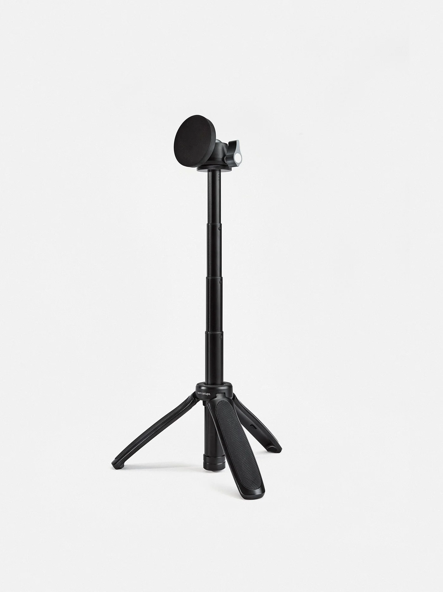
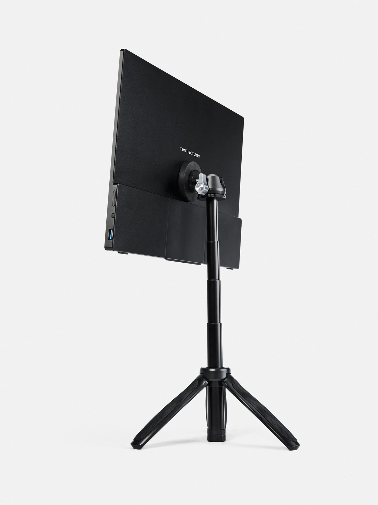
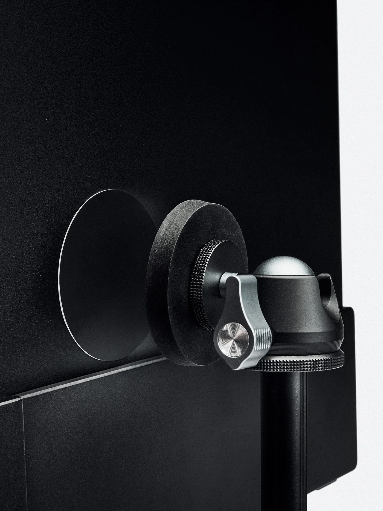
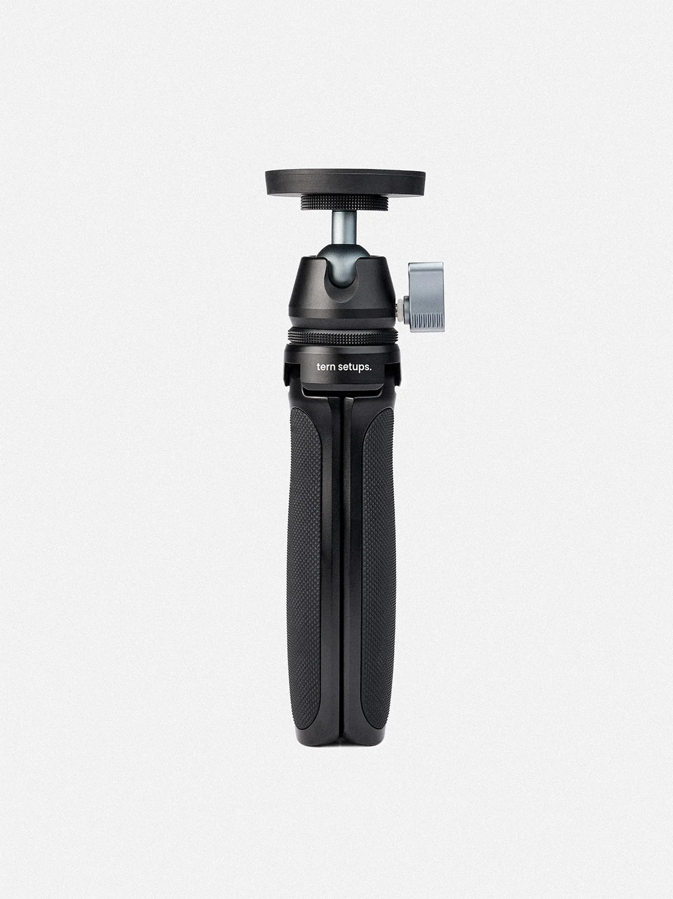

# Accessoires PC Portable & Ecran

## Housse PC Portable

16 pouces pour PC Portable type ThinkPad



16 pouces pour Ecran mobile ou PC Portabble type Ultrabook (Macbook Air/Pro, Dell XPS...)



14 pouces pour PC Portable classique



14 pouces pour Ecran mobile ou PC Portabble type Ultrabook (Macbook Air/Pro, Dell XPS...)



***

## Support PC

### Support compact

Un bon support pour PC Portable est le **`Ringke Folding Stand 2`**.

L'intérêt de ce modèle comparer à d'autres ? Il s’adapte à la plupart des ordinateurs portables ou des tablettes. Il peut également être utilisé comme substitut du tapis de souris. Les plis peuvent être utilisés à deux hauteurs, parfait notamment pour gardez votre ordinateur portable au frais et ventilé en le maintenant surélevé

<figure><figcaption></figcaption></figure> <figure><figcaption></figcaption></figure> <figure><figcaption></figcaption></figure> <figure><figcaption></figcaption></figure> <figure><figcaption></figcaption></figure>



### Support avec port USB intégré





### Support vertical



***

## Support Ecran Mobile

### Support compact



<figure><figcaption></figcaption></figure> <figure><figcaption></figcaption></figure> <figure><figcaption></figcaption></figure> <figure><figcaption></figcaption></figure>



**Support d'écran portable**

Support léger et surélève votre écran ou tablette à hauteur des yeux. Il se range facilement dans un sac à dos et vous permet de choisir la configuration qui vous convient le mieux. Fabriqué en métal léger de haute qualité, il offre un équilibre exceptionnel entre solidité et légèreté.

Les plaques adhésives métalliques incluses peuvent être fixées à l'arrière de n'importe quel moniteur portable ou tablette.




* Hauteur maximale : 32 cm (12,8 po)
* Charge maximale : 1,5 kg (3,3 lbs)
* Poids : 335 g (0,74 lb)
* Taille maximale de l'écran : 18,5 pouces
* Matériau : alliage d'aluminium
* Tête rotative



***


