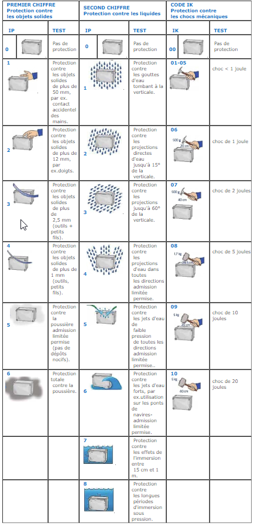

# Indice de protection

## Indices de protection - Image explicative

### Tableau des indices de protections

* 1er chiffre \(dizaine\) : Protection contre les solides
* 2e chiffre \(unité\) : Protection contre l'intrusion d'eau

| Indice | 1er chiffre \(dizaine\) | 2e chiffre \(unité\) |
| :---: | :--- | :--- |
| 0 | Aucune protection. | Aucune protection. |
| 1 | Protégé contre les corps solides supérieurs à 50 mm. | Protégé contre les chutes verticales de gouttes d'eau. |
| 2 | Protégé contre les corps solides supérieurs à 12,5 mm. | Protégé contre les chutes de gouttes d'eau jusqu'à 15° de la verticale. |
| 3 | Protégé contre les corps solides supérieurs à 2,5 mm. | Protégé contre l'eau en pluie jusqu'à 60° de la verticale. |
| 4 | Protégé contre les corps solides supérieurs à 1 mm. | Protégé contre les projections d'eau de toutes directions. |
| 5 | Protégé contre les poussières.et autres résidus microscopiques | Protégé contre les jets d'eau de toutes directions à la lance \(buse de 6,3 mm, distance 2,5 m à 3 m, débit 12,5 l/min ±5 %\). |
| 6 | Totalement protégé contre les poussières. | Protégé contre les forts jets d'eau de toutes directions à la lance \(buse de 12,5 mm, distance 2,5 m à 3 m, débit 100 l/min ±5 %\). |
| 7 | - | Protégé contre les effets de l'immersion temporaire \(jusqu'à 1 m\) et pendant 30 minutes. La pénétration d'eau en quantité nuisible ne sera pas possible lorsque l'équipement est immergé dans l'eau dans des conditions définies de pression et de temps \(jusqu'à 1 m de submersion\). |
| 8 | - | Matériel submersible dans des conditions spécifiées \(immersion prolongée\) au-delà de 1 m. Normalement, cela signifie que l'équipement est hermétiquement fermé. Cependant, avec certains types de matériel, cela peut signifier que l'eau peut pénétrer, mais seulement à condition qu'elle ne produise pas d'effets nuisibles. Protection contre la submersion. |
| 9 | - | Matériel submersible dans des conditions spécifiées \(immersion prolongée\) au-delà de 1 m et Protection contre le nettoyage à haute pression. Normalement, cela signifie que l'équipement est hermétiquement fermé et qu'il peut résister à une haute pression d'eau. |
| 9K | - | Protection contre le nettoyage à haute pression, à haute température et venant de plusieurs directions 4. |

### Lettres additionnelles

Des lettres supplémentaires peuvent être pour fournir des informations complémentaires sur la protection assurée par l'appareil.

| Lettre | Signification |
| :--- | :--- |
| f | Résistant aux huiles |
| H | Appareil pour haute tension |
| M | Appareil en déplacement durant le test à l'eau |
| S | Appareil immobile durant le test à l'eau |
| W | Conditions environnementales |

