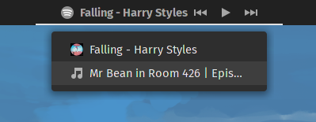
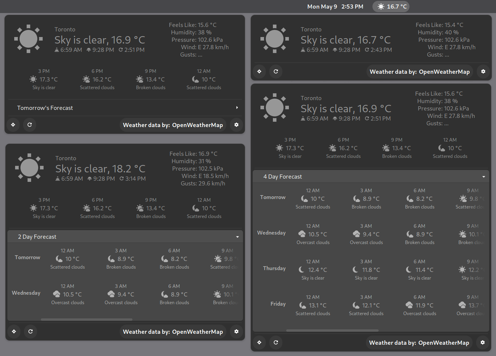
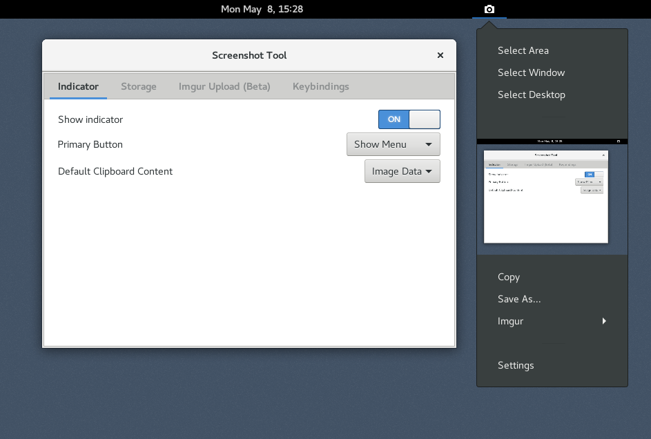
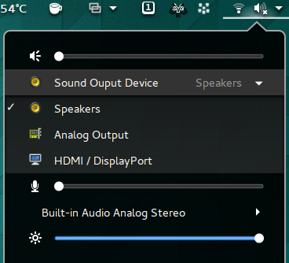
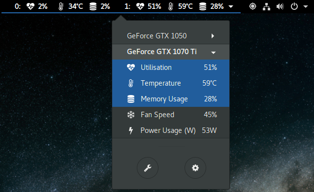
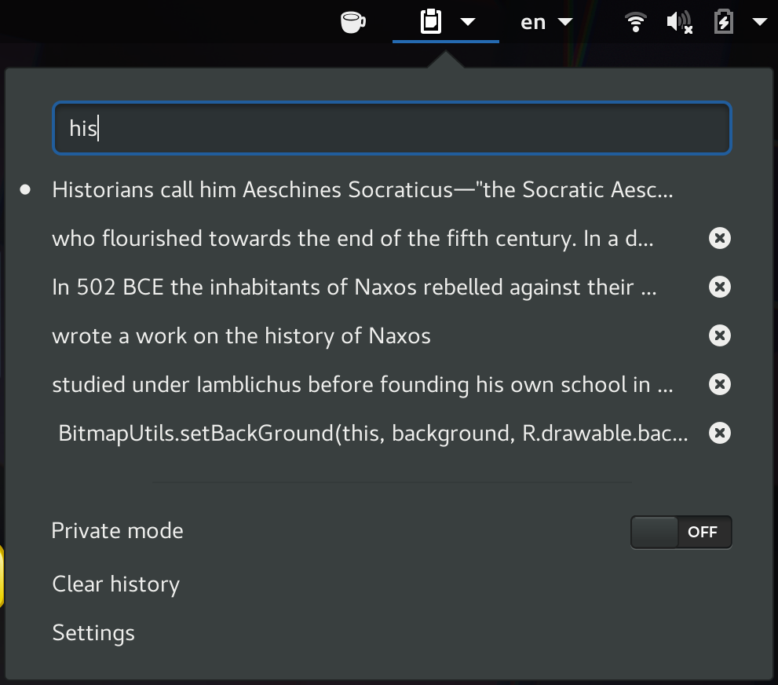
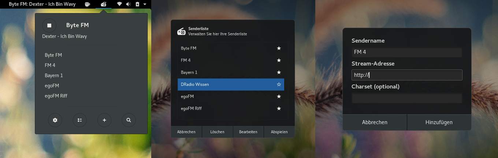

# 👣 Ext. GNOME

## Présentation

[GNOME Extensions](https://gitlab.gnome.org/GNOME/gnome-shell-extensions) est une petite application pour gérer les extensions Shell de GNOME.


Si **Extensions** n'est pas déjà installé sur votre système GNOME, je vous recommande de le télécharger depuis [Flathub](https://flathub.org/apps/details/org.gnome.Extensions).


### Télécharger des extensions


Les extensions sont disponibles sur [https://extensions.gnome.org/](https://extensions.gnome.org/)


## Vitals

Vitals est une extension de GNOME Shell pour afficher la température, la tension, la vitesse du ventilateur, l'utilisation de la mémoire, la charge de traitement, les ressources du système, la vitesse du réseau et les statistiques de stockage dans la barre de menu supérieure de votre GNOME Shell.

<figure><figcaption></figcaption></figure>

#### Installation

```bash
sudo dnf install libgtop2-devel lm_sensors
```

#### Activation

Rendez-vous ensuite sur **** [le site web de Gnome Extensions](https://extensions.gnome.org/extension/1460/vitals/), recherchez **Vitals** et cliquez sur l'icône switch.


À ce stade, Vitals devrait fonctionner. Si vous inversez les étapes 1 et 2 ci-dessus, vous devrez redémarrer votre session en vous déconnectant, puis à nouveau.



Source : [https://github.com/corecoding/Vitals](https://github.com/corecoding/Vitals)


## Dash to Dock for COSMIC

Un fork de Dash to Dock. Un dock pour bureau sur Linux.

<figure><figcaption></figcaption></figure>

#### Installation & Activation

Rendez-vous sur **** [le site web de Gnome Extensions](https://extensions.gnome.org), recherchez **** [**Dash to Dock for COSMIC**](https://extensions.gnome.org/extension/5004/dash-to-dock-for-cosmic/) **** et cliquez sur l'icône switch.


Source : [https://github.com/halfmexican/dash-to-dock-pop/tree/ubuntu-dock](https://github.com/halfmexican/dash-to-dock-pop/tree/ubuntu-dock)


## Media Controls

Affiche les contrôles et les informations du média en cours de lecture dans le panneau.

<figure><figcaption></figcaption></figure>

#### Installation

```bash
sudo dnf install gnome-shell-extension-mediacontrols
```

#### Activation

Rendez-vous ensuite sur **** le [site web de Gnome Extensions](https://extensions.gnome.org/), recherchez **** [**Media Controls**](https://extensions.gnome.org/extension/4470/media-controls/) **** et cliquez sur l'icône switch.


Source : [https://github.com/cliffniff/media-controls/](https://github.com/cliffniff/media-controls/blob/main/README.md)


## OpenWeather

Afficher les informations météorologiques de n'importe quel endroit de la Terre dans le panneau

<figure><figcaption></figcaption></figure>

#### Installation

```bash
sudo dnf install gnome-shell-extension-openweather
```

#### Activation

Rendez-vous sur **** [le site web de Gnome Extensions](https://extensions.gnome.org), recherchez **** [**OpenWeather** ](https://extensions.gnome.org/extension/750/openweather/)et cliquez sur l'icône switch.


Source : [https://gitlab.com/skrewball/openweathe](https://gitlab.com/skrewball/openweather)



Si vous obtenez un ERROR après la mise à jour :

* Redémarrez le shell GNOME (déconnectez-vous).
* ou redémarrez complètement


## Screenshot Tool <a href="#extension_name" id="extension_name"></a>

Créez, copiez, stockez et téléchargez des captures d'écran facilement.

<figure><figcaption></figcaption></figure>

#### Activation

Rendez-vous sur **** le site web de [Gnome Extensions](https://extensions.gnome.org/), recherchez **** [**Screenshot Tool**](https://extensions.gnome.org/extension/1112/screenshot-tool) **** et cliquez sur l'icône switch.


Notes : déconnecter-vous de votre session et reconnecter-vous après la mise à jour.



Source : [https://github.com/OttoAllmendinger/gnome-shell-screenshot](https://github.com/OttoAllmendinger/gnome-shell-screenshot/)


## Sound Input & Output Device Chooser

Affiche une liste des périphériques d'entrée et de sortie du son dans le menu d'état sous le curseur du volume. Les différents ports actifs comme HDMI, haut-parleurs, etc. du même périphérique sont également affichés pour être sélectionnés.


Pré-requis :  V20+ nécessite python comme dépendance.


<figure><figcaption></figcaption></figure>

#### Activation

Rendez-vous sur **** le site web de [Gnome Extensions](https://extensions.gnome.org/), recherchez **** [**Sound Input & Outpout Device Chooser**](https://extensions.gnome.org/extension/906/sound-output-device-chooser/) **** et cliquez sur l'icône switch.


Source : [https://github.com/kgshank/gse-sound-output-device-chooser](https://github.com/kgshank/gse-sound-output-device-chooser)


## NVIDIA GPU Stats Tool <a href="#extension_name" id="extension_name"></a>

Affiche les statistiques du GPU NVIDIA dans la barre d'outils.&#x20;


Pré-requis : Nécessite [nvidia-settings](https://download.nvidia.com/XFree86/Linux-x86\_64/396.51/README/nvidiasettings.html) ou [nvidia-smi](https://download.nvidia.com/XFree86/Linux-x86\_64/396.51/README/nvidia-smi.html).



Inclut le support de [Bumblebee](https://www.bumblebee-project.org/).


<figure><figcaption></figcaption></figure>

#### Activation

Rendez-vous sur **** le site web de [Gnome Extensions](https://extensions.gnome.org/), recherchez **** [**Nvidia GPU Stats Tool**](https://extensions.gnome.org/extension/1320/nvidia-gpu-stats-tool) **** et cliquez sur l'icône switch.


Source : [https://github.com/ethanwharris/gnome-nvidia-extension](https://github.com/ethanwharris/gnome-nvidia-extension)


## Clipboard Indicator

Extension du gestionnaire du presse-papiers pour Gnome.\
Ajoute un indicateur du presse-papiers dans le panneau supérieur et met en cache l'historique du presse-papiers.

<figure><figcaption></figcaption></figure>

#### Installation

#### Option 1 - Installation via git

L'installation via git s'effectue en clonant le dépôt dans votre répertoire local des extensions de gnome-shell (généralement \~/.local/share/gnome-shell/extensions/)

```bash
git clone https://github.com/Tudmotu/gnome-shell-extension-clipboard-indicator.git <extensions-dir>/clipboard-indicator@tudmotu.com
```

Après avoir cloné le repo, l'extension est pratiquement installée mais désactivée. \
Afin de l'activer, exécutez la commande suivante :

```bash
gnome-extensions enable clipboard-indicator@tudmotu.com
```

#### Option 2 - Installation depuis GNOME Extensions

Rendez-vous sur **** le site web de [Gnome Extensions](https://extensions.gnome.org/), recherchez **Clipboard Indicator** et cliquez sur l'icône switch.


Source : [https://github.com/Tudmotu/gnome-shell-extension-clipboard-indicator](https://github.com/Tudmotu/gnome-shell-extension-clipboard-indicator)


## Internet Radio

Pour écouter des radios / webradios

<figure><figcaption></figcaption></figure>

#### Activation

Rendez-vous sur **** le site web de [Gnome Extensions](https://extensions.gnome.org/), recherchez **** [**Internet Radio**](https://extensions.gnome.org/extension/836/internet-radio/) **** et cliquez sur l'icône switch.


Source : [https://github.com/hslbck/gnome-shell-extension-radio](https://github.com/hslbck/gnome-shell-extension-radio)


## Just Perfection GNOME Shell Extension

Désactiver les éléments de l'interface utilisateur de GNOME, modifier le comportement et personnaliser votre bureau GNOME.

<figure><figcaption></figcaption></figure>

#### Activation

Rendez-vous sur **** le site web de [Gnome Extensions](https://extensions.gnome.org/extension/3843/just-perfection/), recherchez **** [**Just Perfection**](https://extensions.gnome.org/extension/3843/just-perfection/) **** et cliquez sur l'icône switch


Source : [https://gitlab.gnome.org/jrahmatzadeh/just-perfection](https://gitlab.gnome.org/jrahmatzadeh/just-perfection)


