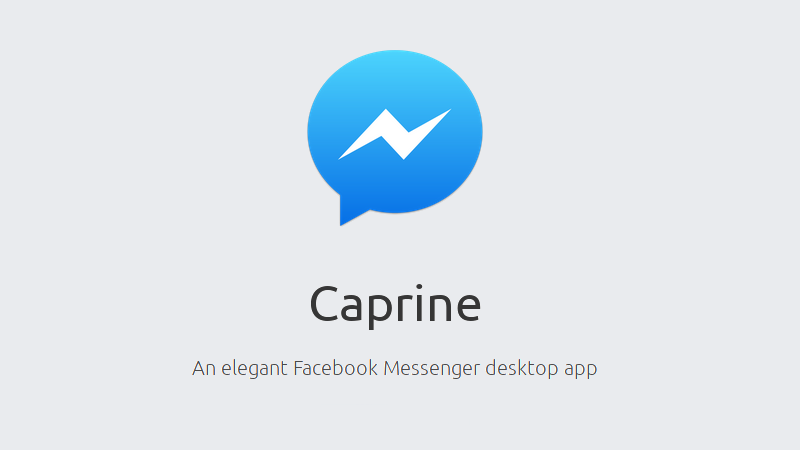

# Internet

## Navigateurs Web

### Firefox


<figure><figcaption></figcaption></figure>

#### Description

Navigateur web de la fondation Mozilla orientée vie privée

#### Installation

```bash
sudo dnf install firefox
```


Source : [https://fedoraproject.org/wiki/How\_to\_debug\_Firefox\_problems](https://fedoraproject.org/wiki/How_to_debug_Firefox_problems)



Site Internet : [https://www.mozilla.org/fr/firefox/all/#product-desktop-release](https://www.mozilla.org/fr/firefox/all/#product-desktop-release)


### Firefox Developer Edition

<figure><figcaption></figcaption></figure>

#### Description

Variante du navigateur web de la fondation Mozilla orientée vie privée

#### Installation


Cette variante officiel du navigateur n’est pas pris en charge par défaut dans les paquet RPM. Il faudra passer par Copr pour pouvoir l’installer


```bash
sudo dnf copr enable the4runner/firefox-dev # Enable the4runner/firefox-dev Copr repository according to your package manager.
sudo dnf check-update                       # (Optionnal)
sudo dnf install firefox-dev                # Install Firefox Dev
firefox-dev                                 # Launch Firefox Dev
```


Source : [https://copr.fedorainfracloud.org/coprs/the4runner/firefox-dev/](https://copr.fedorainfracloud.org/coprs/the4runner/firefox-dev/)


#### Extensions & Themes

Découvrez divers extensions & thèmes sur ce wiki en cliquant sur le lien


[firefox-extensions](../../../logiciels/browsers/firefox-extensions/)


***

### Google Chrome

<figure><figcaption></figcaption></figure>

#### Installation

```bash
sudo dnf install fedora-workstation-repositories	# Install Third Party Repositories
sudo dnf config-manager --set-enabled google-chrome	# Enable the Google Chrome repo
sudo dnf install google-chrome-stable			# Install Google Chrome
```


Source : [https://docs.fedoraproject.org/en-US/quick-docs/installing-chromium-or-google-chrome-browsers/](https://docs.fedoraproject.org/en-US/quick-docs/installing-chromium-or-google-chrome-browsers/)


#### Google Chrome Developers

<figure><figcaption></figcaption></figure>

#### Installation

```bash
sudo dnf install google-chrome-unstable
```


Source : [https://docs.fedoraproject.org/en-US/quick-docs/installing-chromium-or-google-chrome-browsers/](https://docs.fedoraproject.org/en-US/quick-docs/installing-chromium-or-google-chrome-browsers/)


***

### **Ungoogled Chromium**

<figure><figcaption></figcaption></figure>

_Ungoogled Chromium_ est un navigateur qui conserve l’expérience utilisateur par défaut de **Chromium** mais sans les dépendances aux services web de Google (comme Google Host Detector, Google URL Tracker, Google Cloud Messaging, Google Hotwording, etc.), tout en offrant des tas d’options pour améliorer la confidentialité et le contrôle de vos données.


La version RPM / DNF n'est plus maintenu.



Vous pouvez la télécharger depuis le repo [https://github.com/ungoogled-software/ungoogled-chromium](https://github.com/ungoogled-software/ungoogled-chromium), et télécharger la version **AppImage** (compatible Fedora).

Second choix, une version **Flatpak** est disponible ici : [https://flathub.org/apps/com.github.Eloston.UngoogledChromium](https://flathub.org/apps/com.github.Eloston.UngoogledChromium)



Source : [https://github.com/ungoogled-software/ungoogled-chromium-fedora](https://github.com/ungoogled-software/ungoogled-chromium-fedora)


***

### Microsoft Edge

<figure><figcaption></figcaption></figure>

#### Installation

```bash
# Importer la clé GPG pour l'import du fichier RPM
sudo rpm --import https://packages.microsoft.com/keys/microsoft.asc

# Importer le répertoire de Microsoft Edge
sudo dnf config-manager --add-repo https://packages.microsoft.com/yumrepos/edge

# Installation Microsoft Edge
sudo dnf install microsoft-edge-stable
```

### Microsoft Edge Developer Edition

#### Installation

```bash
# Importer la clé GPG pour l'import du fichier RPM
sudo rpm --import https://packages.microsoft.com/keys/microsoft.asc

# Importer le répertoire de Microsoft Edge
sudo dnf config-manager --add-repo https://packages.microsoft.com/yumrepos/edge

# Installation Microsoft Edge
sudo dnf install microsoft-edge-dev
```


Notez que celles-ci ne remplacent pas votre version stable, et elles sont installées séparément.



Source : [https://www.linuxcapable.com/install-microsoft-edge-on-fedora-linux/](https://www.linuxcapable.com/install-microsoft-edge-on-fedora-linux/)



Site internet : [https://www.microsoft.com/fr-fr/edge/download?form=MA13FJ](https://www.microsoft.com/fr-fr/edge/download?form=MA13FJ)


***

## NextDNS

<figure><figcaption></figcaption></figure>

#### Description


[nextdns.md](../../../articles/dns/nextdns.md)


#### Installation


Avant d'aller plus loin dans le guide d'installation, il vous faudra votre user ID (récupérer-le et poursuivez ensuite l'installation)


Taper la ligne de commande ci-dessous et suivez les instructions

```bash
sh -c "$(curl -sL https://nextdns.io/install)"
```

#### Installation manuelle

```bash
# Install the binary
sudo curl -Ls https://repo.nextdns.io/nextdns.repo -o /etc/yum.repos.d/nextdns.repo
sudo yum install -y nextdns

# Configuration for a workstation:
sudo nextdns install \
  -config <your config id> \
  -report-client-info \
  -auto-activate

# Configuration for a router/server:
sudo nextdns install \
  -config <your config id> \
  -report-client-info \
  -setup-router
```

#### Basic Usage

```bash
nextdns start       # Start the daemon
nextdns stop        # Stop the daemon
nextdns restart     # Restart the daemon
nextdns activate    # Activate the local host to point to NextDNS
nextdns desactivate # Desactivate the local host to point to NextDNS
nextdns log         # Show daemon logs
nextdns help        # Show all commands
```


Source : [https://github.com/nextdns/nextdns/wiki/RPM-Based-Distribution](https://github.com/nextdns/nextdns/wiki/RPM-Based-Distribution)


***

## Discord

<figure><figcaption></figcaption></figure>

#### Description

Discord est un logiciel propriétaire gratuit de VoIP et de messagerie instantanée

#### Installation

```bash
sudo dnf update
sudo dnf install discord
```


Source : [https://itsfoss.com/install-discord-fedora/](https://itsfoss.com/install-discord-fedora/)



Site internet : [https://discord.com/download](https://discord.com/download)


#### Désactiver le pop de mise à jour automatique (parfois bloquant)

Ouvrer le fichier `settings.json` qui se trouve dans le dossier `.config/discord/`\
et ajouter la valeur suivante : `"SKIP_HOST_UPDATE": true`

***

## Caprine

<figure><figcaption></figcaption></figure>

#### Description

Caprine est une client moderne et axé vie privée pour Facebook Messenger


Il n'existe pas de package linux pour **Facebook Messenger**, en lieu et place nous utiliserons **Caprine.** Une application non officielle disponible sur _SnapCraft_, axée sur la vie privée avec de nombreuses fonctionnalités utiles.


#### Installation

```bash
sudo dnf install snapd                # Enable Snapd
sudo ln -s /var/lib/snapd/snap /snap  # Enable classic snap support, enter the following to create a symbolic link
sudo snap install caprine             # Install Caprine
```


Source : [https://github.com/sindresorhus/caprine](https://github.com/sindresorhus/caprine)



Site internet : [https://sindresorhus.com/caprine/](https://sindresorhus.com/caprine/)


***

## Signal

<figure><figcaption></figcaption></figure>

#### Description

Signal Desktop est un client desktop pour le logiciel de messagerie Signal.\
Celui-ci est disponible via un paquet Flatpak

```bash
flatpak remote-add --if-not-exists flathub https://dl.flathub.org/repo/flathub.flatpakrepo # Installer Flathub
flatpak install flathub org.signal.Signal                                                  # Installer Signal
flatpak run org.signal.Signal                                                              # Lancer Signal
```

#### Installation


Source : [https://flathub.org/apps/org.signal.Signal](https://flathub.org/apps/org.signal.Signal)


***

## Client mail

### Thunderbird

<figure><figcaption></figcaption></figure>

#### Description

Par défaut, Thunderbird est disponible sur le dépôt Fedora et est souvent mis à jour en tant que Flatpak. Utilisez la commande suivante pour installer l'application sur votre système.

#### Installation

```bash
sudo dnf install thunderbird -y
```


Source : [https://www.linuxcapable.com/how-to-install-thunderbird-on-fedora-linux/](https://www.linuxcapable.com/how-to-install-thunderbird-on-fedora-linux/)



Site internet : [https://www.thunderbird.net/fr/](https://www.thunderbird.net/fr/)


### Mailspring

<figure><figcaption></figcaption></figure>

#### Description

Un client mail open-source multi-plateformes

#### Installation

La dernière version de Mailspring est disponible via un paquage RPM [téléchargeable depuis le site web](https://www.getmailspring.com/). Rendez-vous sur la page de téléchargement, sélectionnez "Linux" et cliquez sur "Linux (64-bit .rpm)".&#x20;

Ensuite, ouvrez une fenêtre de terminal et utilisez la commande CD pour le déplacer dans le dossier \~/Downloads.

```bash
cd ~/Downloads
```

Installez le RPM de Mailspring sur votre PC Fedora avec la commande DNF install suivante :

```bash
sudo dnf install mailspring-*.x86_64.rpm -y
```


Source : [https://www.addictivetips.com/ubuntu-linux-tips/install-mailspring-on-linux/](https://www.addictivetips.com/ubuntu-linux-tips/install-mailspring-on-linux/)



Site internet : [https://www.getmailspring.com/](https://www.getmailspring.com/)


***

## Téléchargement

### Varia

<figure><figcaption></figcaption></figure>

#### Description

Un gestionnaire de téléchargement avec un GUI moderne adapté à GNOME

#### Installation

```bash
flatpak install flathub io.github.giantpinkrobots.varia # Installer Varia
flatpak run io.github.giantpinkrobots.varia             # Lancer Varia
```


Source : [https://github.com/giantpinkrobots/varia](https://github.com/giantpinkrobots/varia)



Site internet : [https://flathub.org/apps/io.github.giantpinkrobots.varia](https://flathub.org/apps/io.github.giantpinkrobots.varia)


***

## Gnome Feeds

<figure><figcaption></figcaption></figure>

#### Description

Un lecteur RSS open-source pour Linux

#### Installation

```bash
sudo dnf install gnome-feeds
```


Source : [https://gitlab.gnome.org/World/gfeeds](https://gitlab.gnome.org/World/gfeeds)



Site internet : [https://gfeeds.gabmus.org/#install](https://gfeeds.gabmus.org/#install)


***

## Joplin

<figure><figcaption></figcaption></figure>

#### Description

Un gestionnaire open-source de prise de notes multi-plateformes

#### Installation

```bash
wget -O - https://raw.githubusercontent.com/laurent22/joplin/dev/Joplin_install_and_update.sh | bash
```


Source : [https://github.com/laurent22/joplin/](https://github.com/laurent22/joplin/)



Site internet : [https://joplinapp.org/help/install/](https://joplinapp.org/help/install/)

