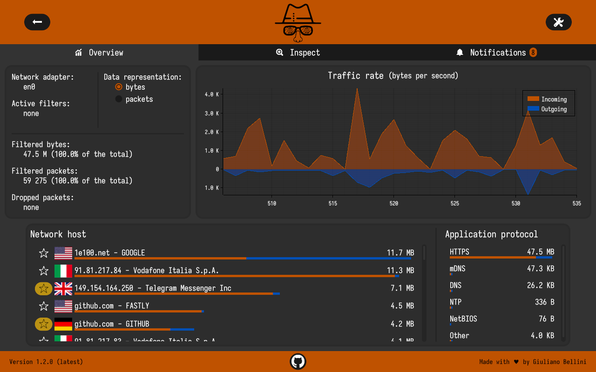
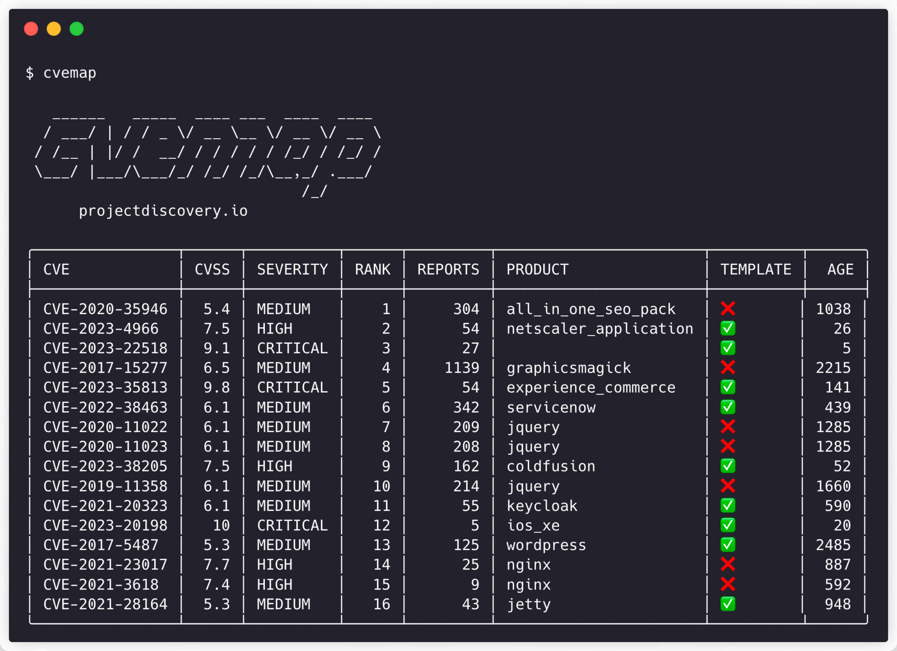

# Sécurité

## firewalld

<figure><figcaption></figcaption></figure>

firewalld est un pare-feu open-source

```bash
sudo dnf install firewalld	    # Install firewalld
sudo firewall-cmd --state	    # Checking the firewalld status
firewall-config			    # Viewing current firewalld settings using GUI
sudo systemctl unmask firewalld	    # Start firewalld, by entering the following commands
sudo systemctl start firewalld		
sudo systemctl enable firewalld	    # make firewalld start automatically at system start
```


Source : [https://docs.fedoraproject.org/fr/quick-docs/firewalld/](https://docs.fedoraproject.org/fr/quick-docs/firewalld/)


***

## ClamAV

<figure><figcaption></figcaption></figure>

ClamAV est Antivirus open-source

#### Guide d'installation


Pré-requis : mettre à jour le système d'exploitation


```bash
sudo dnf upgrade --refresh -y
```

#### Installation des dépendances

```bash
sudo dnf install dnf-plugins-core -y
```

#### Installer ClamAV

```bash
sudo dnf install clamav clamd clamav-update
```


Vérifier si l'installation a réussi, une version et le numéro de build devrait s'afficher


```bash
clamd --version
```

Fedora utilise [SELinux](https://www.redhat.com/fr/topics/linux/what-is-selinux) ; étant donné le fonctionnement de ClamAV, vous devrez le configurer pour qu'il n'y ait pas d'interférences.

```bash
sudo setsebool -P antivirus_can_scan_system 1
```

#### Mettre à jour la bade de données de virus

Après avoir installé ClamAV, il est conseillé de mettre à jour votre base de données de définitions de virus avant de commencer à utiliser le scanner de virus

```bash
sudo systemctl stop clamav-freshclam  # Arreter le service
sudo freshclam                        # Mise à jour de la bdd
sudo systemctl start clamav-freshclam # Démarrer le service
systemctl status clamav-freshclam     # Vérifier le statut
```

#### Activer ou désactiver ClamAV au démarrage

```bash
sudo systemctl enable clamav-freshclam  # Activer ClamAV au démarrage
sudo systemctl disable clamav-freshclam # Désactiver ClamAV au démarrage
```

#### Désinstaller ClamAV

```bash
sudo dnf autoremove clamav clamd clamav-update
```


Notez que cela supprimera toutes les dépendances inutilisées installées avec ClamAV pour une désinstallation complète.



Source : [https://www.clamav.net/documents/clam-antivirus-user-manual](https://www.clamav.net/documents/clam-antivirus-user-manual) &  [https://www.linuxcapable.com/how-to-install-clamav-on-fedora-35/](https://www.linuxcapable.com/how-to-install-clamav-on-fedora-35/#Update_Operating_System)


***

### ClamTk

ClamTk est un GUI (une interface) pour ClamAV (Clam Antivirus). \
Il est destiné à être facile d'utilisation, léger et facile à utiliser pour les systèmes Linux.

#### Installation

```bash
sudo dnf install clamtk
```

#### Désinstallation

```bash
sudo dnf erase clamtk
```


Source : [https://github.com/dave-theunsub/clamtk](https://github.com/dave-theunsub/clamtk)


***

## RustDesk

<figure><figcaption></figcaption></figure>

Un logiciel de contrôle de bureau à distance, écrit en Rust. Fonctionne sans configuration. Vous avez le contrôle de vos données, sans se soucier de la sécurité. Il est possible d'utiliser un serveur relais mis à disposition par rustdesk, de l'auto-heberger avec le serveur de démonstration ou d'écrire votre propre serveur relais.


Installation avec le paquet RPM :  [https://github.com/rustdesk/rustdesk/releases](https://github.com/rustdesk/rustdesk/releases) > Fedora


***

## Bitwarden

<figure><figcaption></figcaption></figure>

Il existe plusieurs possiblités d'installer Bitwarden sur Fedora, je préfère vous sélectionner celles-ci (via Snap), car il sera possible de mettre à jour le soft régulièrement.&#x20;

#### Installation manuel

Il est possible d'installer Bitwarden avec un paquet RPM officiel

```bash
https://vault.bitwarden.com/download/?app=desktop&platform=linux&variant=rpm
```


Cependant celui-ci n'est pas mise à jour automatiquement.


#### Installation via Snapcraft


Pré-requis : **Snapd** est nécéssaire


```bash
sudo dnf install snapd
```

```bash
sudo snap install bitwarden
```


Source : [https://bitwarden.com/download/](https://bitwarden.com/download/)



Il existe également une CLI pour Bitwarden, vous pouvez la télécharger depuis la page d'aide : [https://bitwarden.com/help/cli/](https://bitwarden.com/help/cli/)


***

## 1Password

<figure><figcaption></figcaption></figure>

Installation de 1Password en utilisant votre gestionnaire de paquets

1.  Ajout de la clé du repo yum 1Password :

    ```bash
     sudo rpm --import https://downloads.1password.com/linux/keys/1password.asc
    ```
2.  Ajouter le repo yum 1Password :

    ```bash
     sudo sh -c 'echo -e "[1password]\nname=1Password Stable Channel\nbaseurl=https://downloads.1password.com/linux/rpm/stable/\$basearch\nenabled=1\ngpgcheck=1\nrepo_gpgcheck=1\ngpgkey=\"https://downloads.1password.com/linux/keys/1password.asc\"" > /etc/yum.repos.d/1password.repo'
    ```
3.  Installer 1Password:

    ```bash
     sudo dnf install 1password
    ```


Source : [https://1password.com/fr/downloads/linux/](https://1password.com/fr/downloads/linux/)


***

## Sniffnet

<figure><figcaption></figcaption></figure>

#### Description

Sniffnet est un outil technique open-source qui se concentre fortement sur l'ensemble de l'expérience de l'utilisateur. La plupart des analyseurs de réseau sont encombrants à utiliser, tandis que l'une des pierres angulaires de Sniffnet est d'être utilisable avec facilité par tout le monde.

#### Installation


Site internet : [https://sniffnet.net/download/](https://sniffnet.net/download/)


***

## CVEmap

<figure><figcaption></figcaption></figure>

Un outil d'interface de ligne de commande (CLI) conçu pour fournir une interface structurée et facilement navigable à diverses bases de données de vulnérabilité (CVE)

Notes : pratique pour les amoureux du terminal. Pour les autres, vous avez aussi [CVEdetails](https://www.cvedetails.com/) qui est une bonne référence en la matière

#### Installation


Pré-requis : **Go** est nécéssaire


```bash
## Installer Go
sudo dnf install golang

## Installer CVEmap
sudo go install github.com/projectdiscovery/cvemap/cmd/cvemap@latest
```


Site : [https://github.com/projectdiscovery/cvemap](https://github.com/projectdiscovery/cvemap)

