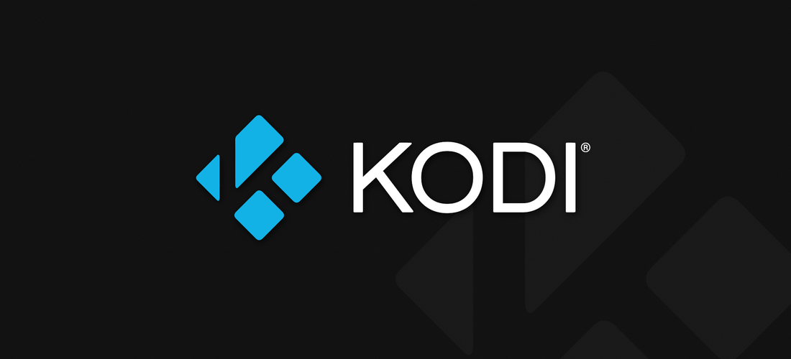

# 📺 Video

## VLC

<figure><figcaption></figcaption></figure>

#### Description

VLC (VideoLAN Client) est un lecteur multimédia open source. \
Il est capable de lire une large gamme de formats audio et vidéo, y compris les fichiers multimédias locaux, les flux réseau, les DVD, les CD audio, et même les flux de diffusion en continu.&#x20;

VLC est apprécié pour sa compatibilité étendue, sa simplicité d'utilisation, sa légèreté et sa capacité à fonctionner sur plusieurs plates-formes, notamment Windows, macOS, Linux, Android et iOS. En outre, il est connu pour son support des codecs variés, éliminant ainsi le besoin d'installer des codecs tiers.

#### Installation&#x20;

```bash
su -
sudo dnf install https://download1.rpmfusion.org/free/fedora/rpmfusion-free-release-$(rpm -E %fedora).noarch.rpm
sudo dnf install https://download1.rpmfusion.org/nonfree/fedora/rpmfusion-nonfree-release-$(rpm -E %fedora).noarch.rpm
sudo dnf install vlc
```


Source : [https://www.videolan.org/vlc/download-fedora.html](https://www.videolan.org/vlc/download-fedora.html)


### Télévision

Voici une liste des meilleurs chaînes IPTV gratuites et sans abonnement

Celle-ci est extraite d'[un dépôt Github qui compile plusieurs playlists au format .m3u](https://github.com/iptv-org/iptv) regroupant plus de 20 000 streams en IPTV.


Disclaimer : Rien d’illégal pour l’utilisateur ici, c’est tout simplement des chaînes dont **les flux sont accessibles gratuitement et légalement sur le web sans décodeur**.


Lancez VLC ou un lecteur vidéo capable de lire les fichiers M3U.\
\
Puis faites **Fichier -> Ouvrir un flux réseau** et copiez collez simplement l’un des liens ci-dessous :

### Liste de chaînes

#### Liste générale

```bash
https://iptv-org.github.io/iptv/index.m3u
```

#### Liste générale + chaînes adultes (NSFW)

```
https://iptv-org.github.io/iptv/index.nsfw.m3u
```

#### Triée par pays

```
https://iptv-org.github.io/iptv/index.category.m3u
```

#### Triée par langues

```
https://iptv-org.github.io/iptv/index.language.m3u
```

#### Triée par pays

```
https://iptv-org.github.io/iptv/index.country.m3u
```

#### Triée par zone géographiques

```
https://iptv-org.github.io/iptv/index.region.m3u
```


Source : [https://github.com/iptv-org/iptv](https://github.com/iptv-org/iptv)


## YouTube-DL

#### Description

Youtube-dl est un utilitaire en ligne de commande open source qui permet de télécharger des vidéos depuis de nombreuses plateformes de diffusion en ligne, telles que YouTube, Vimeo, Dailymotion, et bien d'autres

L'outil est écrit en Python et fonctionne sur divers systèmes d'exploitation, notamment Windows, macOS et Linux. \
L'utilisation de `youtube-dl` est relativement simple : vous fournissez l'URL de la vidéo que vous souhaitez télécharger en ligne de commande, et l'outil se charge du téléchargement en extrayant la vidéo dans le format disponible de la meilleure qualité possible.

#### Installation


Il ne s'agit pas d'une version officiel maintenu par Google


```bash
sudo dnf install python-pip
```


**Pré-requis :** python package manager (pip) est requis pour l'installation


```bash
sudo pip install youtube-dl              # Installation
sudo pip install --upgrade youtube-dl    # Mise à jour
sudo pip uninstall youtube-dl            # Désinstallation
```


Source : [https://lintut.com/install-youtube-dl-on-linux-and-how-to-use-it/](https://lintut.com/install-youtube-dl-on-linux-and-how-to-use-it/)



Souce : [https://github.com/ytdl-org/youtube-dl](https://github.com/ytdl-org/youtube-dl)


## YouTubeDL-GUI

<figure><figcaption><p>Youtube Downloader</p></figcaption></figure>

Une interface graphique pour YouTube-DL

#### Installation

```bash
flatpak install flathub io.github.JaGoLi.ytdl_gui
```


Site internet : [https://flathub.org/apps/io.github.JaGoLi.ytdl\_gui](https://flathub.org/apps/io.github.JaGoLi.ytdl\_gui)


## OBS Studio

<figure><figcaption></figcaption></figure>

#### Description

OBS Studio (Open Broadcaster Software Studio), est un logiciel open source et gratuit conçu pour l'enregistrement vidéo et la diffusion en direct. Il offre des fonctionnalités avancées pour la capture de contenu à partir de différentes sources, telles que des webcams, des fenêtres d'application, des captures d'écran, des cartes de capture et plus encore.

#### Installation

```bash
sudo dnf install obs-studio       # OBS Studio
sudo dnf install obs-studio-devel # OBS Studio’s development packages
```


Source : [https://github.com/obsproject/obs-studio](https://github.com/obsproject/obs-studio)



Site internet : [https://obsproject.com/fr](https://obsproject.com/fr)


## Kodi Media Center

<figure><figcaption></figcaption></figure>

#### Description

Kodi est un logiciel open source de centre multimédia, anciennement connu sous le nom de XBMC (Xbox Media Center). Il offre une plateforme de divertissement complète en transformant votre ordinateur, smartphone, tablette, ou même un dispositif matériel comme un Raspberry Pi, en un centre multimédia.

Le logiciel est populaire parmi les utilisateurs qui souhaitent organiser et accéder facilement à leur bibliothèque multimédia personnelle, ainsi que ceux qui veulent étendre leurs options de divertissement en utilisant des modules complémentaires tiers.

#### Installation

```bash
sudo dnf install -y https://mirrors.rpmfusion.org/free/fedora/rpmfusion-free-release-$(rpm -E %fedora).noarch.rpm https://mirrors.rpmfusion.org/nonfree/fedora/rpmfusion-nonfree-release-$(rpm -E %fedora).noarch.rpm
# Import du dossier RPM Fusion depuis Fedora

sudo dnf install kodi
# Installation de Kodi
```

### Configurer FirewallD pour Kodi

Créer un nouveau fichier de service FirewallD nommé `kodi-http.xml` pour autoriser l'accès HTTP à Kodi

<pre class="language-bash"><code class="lang-bash"><strong>sudo nano /etc/firewalld/services/kodi-http.xml
</strong></code></pre>

Insérez le contenu suivant dans le fichier

```xml
<?xml version="1.0" encoding="utf-8"?>
<service>
  <short>Kodi HTTP</short>
  <description>Allow access to Kodi via HTTP</description>
  <port protocol="tcp" port="8080"/>
</service>
```

Sauvegardez et fermez le fichier. Rechargez la configuration de FirewallD et ajoutez le nouveau service à votre zone active de pare-feu avec les commandes suivantes :

```bash
sudo firewall-cmd --reload
sudo firewall-cmd --add-service=kodi-http --permanent
sudo firewall-cmd --reload
```

**Notes :** Bien que cet exemple ne concerne que l'accès HTTP, vous pouvez créer des fichiers de service FirewallD supplémentaires pour d'autres services Kodi, tels que UPnP (`kodi-upnp.xml`) et EventServer (`kodi-eventserver.xml`), en suivant les mêmes étapes et en modifiant les numéros de port si nécessaire.

Veillez à remplacer le numéro de port dans la balise par la valeur correcte pour chaque service. Après avoir généré les fichiers de service nécessaires, rechargez la configuration de FirewallD et ajoutez les services à votre zone de pare-feu active, comme illustré précédemment.


Source : [https://github.com/xbmc](https://github.com/xbmc)



Site internet : [https://kodi.tv/](https://kodi.tv/)


### Extensions

#### Catch-up TV & More

Cette extension regroupe l’ensemble des vidéos des différents services et chaînes de Replay TV (rattrapage TV). De plus, cette extension vous permet d’accéder rapidement aux vidéos et contenus proposés par certains sites internet.


Site internet : [https://catch-up-tv-and-more.github.io/fr/](https://catch-up-tv-and-more.github.io/fr/)


#### Orange TV France for Kodi


Cet addon n'est pas officiellement supporté par Orange.



Source : [https://github.com/BreizhReloaded/plugin.video.orange.fr/](https://github.com/BreizhReloaded/plugin.video.orange.fr/)


Cete extension permets d'ajouter la TV d'Orange à Kodi. Toutes les chaînes inclues dans votre abonnement sont maintenant directement accessibles depuis Kodi.

#### Installation

Téléchargez l'archive de la [dernière version](https://github.com/BreizhReloaded/plugin.video.orange.fr/releases/latest) et installez-la directement depuis Kodi&#x20;

```markup
Settings > Addons > Install from ZIP
```

Installez ensuite les dépendences depuis l'écan de l'adddon

```markup
My addons > Video addons > Orange TV France > Dependencies
```

L'intégration à la télévision sur Kodi se fait via **IPTV Manage**r.&#x20;


Source : [https://github.com/add-ons/service.iptv.manager](https://github.com/add-ons/service.iptv.manager)


Vous pouvez l'installer et l'activer directement depuis les réglages de l'addon.&#x20;

Une fois configuré, les chaînes et le programme TV se chargent automatiquement.


_NB: vous pouvez également choisir l'intégration basique, dans ce cas vous devez passer manuellement à_ [_IPTV Simple_](https://github.com/kodi-pvr/pvr.iptvsimple) _les fichiers .m3u8 et .xml situés dans le dossier data._


Vous devriez maintenant voir toutes les chaînes regroupées par categories dans la section TV. \
S'il n'est pas déjà installé, Kodi vous demandera d'installer l'outil de décryptage quand vous regarderez une chaîne pour la première fois.

N'oubliez pas de configurer IPTV Manager correctement et de sélectionner le bon fournisseur dans les paramètres ;) !

## GridPlayer

<figure><figcaption></figcaption></figure>

Un outil qui permets de lire plusieurs flux vidéos dans la même fenêtre

#### Installation


Installation : [https://github.com/vzhd1701/gridplayer#linux](https://github.com/vzhd1701/gridplayer#linux)



Source : [https://github.com/vzhd1701/gridplayer](https://github.com/vzhd1701/gridplayer)

