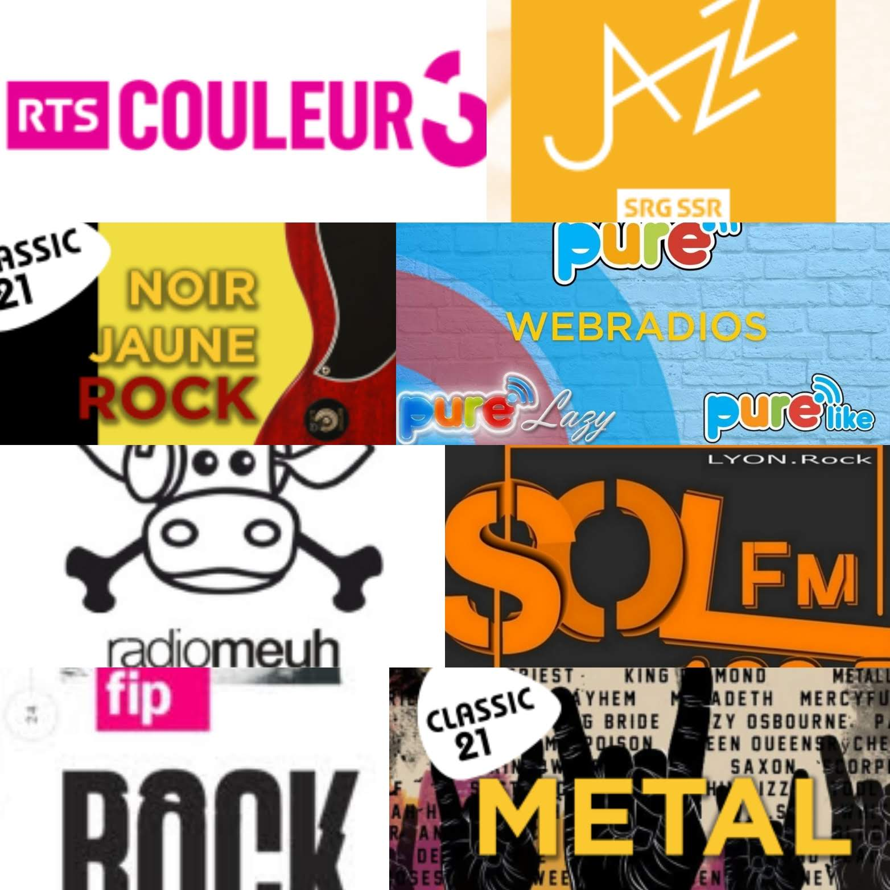

# Radios / Webradios

## Comment écouter une radio / webradio ?

Pour écouter des webradios, plusieurs options d’écoute sont possible :

* Par le site internet ou l'application mobile de la webradio \(si celle-ci existe\)
* En utilisant un logiciel comme [TuneIn](http://tunein.com/), [RadioLine](http://www.radioline.co/) ou [Radio.fr](http://www.radio.fr/) \(disponible sur Android, Android TV, iOS, Windows10\), 
* Ou en utilisant une application mobile tierce. Exemple sur Android avec [Podcast Addict](https://play.google.com/store/apps/details?id=com.bambuna.podcastaddict&hl=fr) \(nécessitera un peu de temps la première fois\)

## Liste de webradios

| Nom | Lien | Remarques |
| :--- | :--- | :--- |
| RadioMeuh | [http://www.radiomeuh.com/](http://www.radiomeuh.com/) |  |
| Couleur 3 | [https://programmesradio.rts.ch/couleur3/](https://programmesradio.rts.ch/couleur3/) |  |
| Radio Swiss Jazz | [http://www.radioswissjazz.ch/fr](http://www.radioswissjazz.ch/fr) |  |
| FIP | [https://www.fip.fr/](https://www.fip.fr/) |  |
| FIP rock | [https://www.fip.fr/rock/webradio](https://www.fip.fr/rock/webradio) |  |
| FIP jazz | [https://www.fip.fr/jazz/webradio](https://www.fip.fr/jazz/webradio) |  |
| FIP Groove | [https://www.fip.fr/groove/webradio](https://www.fip.fr/groove/webradio) |  |
| FIP l'été métal | [https://www.fip.fr/fip-metal/webradio](https://www.fip.fr/fip-metal/webradio) |  |
| France Info | [https://www.francetvinfo.fr/en-direct/radio.html](https://www.francetvinfo.fr/en-direct/radio.html) |  |
| SOL FM | [http://www.sol-fm.fr/](http://www.sol-fm.fr/) |  |
| Radio Brume | [http://www.radiobrume.fr/](http://www.radiobrume.fr/) |  |
| Classic 21 | [http://www.rtbfradioplayer.be/radio/liveradio/classic21](http://www.rtbfradioplayer.be/radio/liveradio/classic21) |  |
| Classic 21 Metal | [http://www.rtbfradioplayer.be/radio/liveradio/webradio-classic21-metal](http://www.rtbfradioplayer.be/radio/liveradio/webradio-classic21-metal) |  |
| Classic 21 Soulpower | [http://www.rtbfradioplayer.be/radio/liveradio/webradio-classic21-soul](http://www.rtbfradioplayer.be/radio/liveradio/webradio-classic21-soul) |  |
| Classic 21 Blues | [http://www.rtbfradioplayer.be/radio/liveradio/webradio-classic21-blues](http://www.rtbfradioplayer.be/radio/liveradio/webradio-classic21-blues) |  |
| Classic 21 Noir Jaune Rock | [http://www.rtbfradioplayer.be/radio/liveradio/wr-eventradio](http://www.rtbfradioplayer.be/radio/liveradio/wr-eventradio) |  |
| Rouge rock | [https://www.rouge.com/rouge-web-radio\#](https://www.rouge.com/rouge-web-radio#) |  |
| PureFM | [http://www.rtbfradioplayer.be/radio/liveradio/purefm](http://www.rtbfradioplayer.be/radio/liveradio/purefm) |  |
| Pure Like | [http://www.rtbfradioplayer.be/radio/liveradio/webradio-purelike](http://www.rtbfradioplayer.be/radio/liveradio/webradio-purelike) |  |

