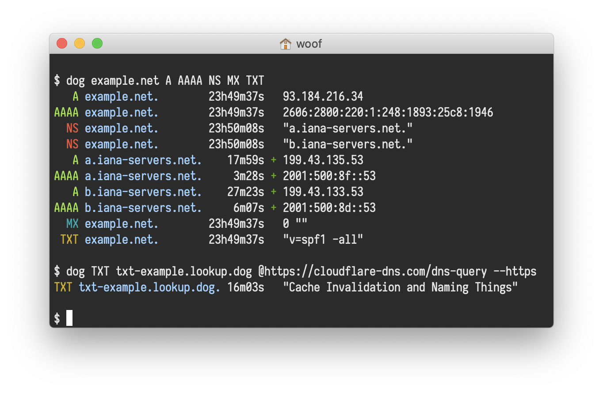

# 📟 Terminal

## TMUX

<figure><figcaption></figcaption></figure>

### **Description**

**tmux** est un multiplexeur de terminaux libre en mode texte. Il permet d'utiliser plusieurs terminaux virtuels dans une seule fenêtre de terminal ou une session sur un terminal distant. tmux peut être détaché d'une session et continuer de fonctionner en arrière-plan, on peut également s'y rattacher plus tard. [Wikipédia](https://fr.wikipedia.org/wiki/Tmux)

### Installation

```bash
sudo dnf -y install tmux
```

Source : [https://fedoramagazine.org/use-tmux-more-powerful-terminal/](https://fedoramagazine.org/use-tmux-more-powerful-terminal/)


Tmux Cheat Sheet : [https://tmuxcheatsheet.com](https://tmuxcheatsheet.com/)


## Dog

<figure><figcaption></figcaption></figure>

dog est un client DNS en ligne de commande comme dig. Il utilise une syntax colorée qui comprend la syntaxe normale des arguments en ligne de commande. Le client supporte les protocoles DNS-over-TLS et DNS-over-HTTPS, et peut émettre du JSON.

```bash
sudo dnf install snapd		      # Enable Snapd
sudo ln -s /var/lib/snapd/snap /snap  # Enable classic snap support, enter the following to create a symbolic link
sudo snap install dog		      # Install dog
```


Source : [https://snapcraft.io/install/dog/fedora](https://snapcraft.io/install/dog/fedora)



Site web : [https://github.com/ogham/dog](https://github.com/ogham/dog)&#x20;


### Cyberduck CLI

<figure><figcaption></figcaption></figure>

Un outil de transfert de fichiers qui s'exécute dans votre shell sous Linux & OS X ou votre invite de ligne de commande Windows. Modifiez des fichiers sur des serveurs distants, téléchargez, chargez et copiez entre des serveurs avec FTP, SFTP ou WebDAV, ainsi que la prise en charge des déploiements de stockage dans le cloud Amazon S3 et OpenStack Swift.

```bash
echo -e "[duck-stable]\nname=duck-stable\nbaseurl=https://repo.cyberduck.io/stable/\$basearch/\nenabled=1\ngpgcheck=0" | sudo tee /etc/yum.repos.d/duck-stable.repo
sudo yum install duck
```


Source & Site web : [https://duck.sh/](https://duck.sh/)


