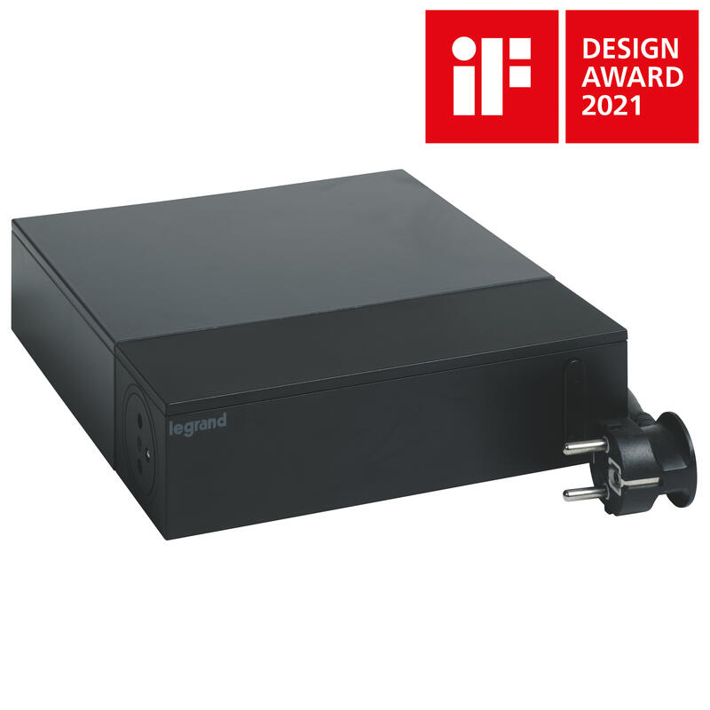

# Legrand 0 494 30

### Description

<figure><figcaption></figcaption></figure>

Il s'agit d'une multiprise avec parafoudre et interrupteur. Il à été conçu pour une usage multimédia / télévision, pour autant elle pourra très bien vous satisfaire pour d'autres usages (pour votre bureau informatique notamment, ou telecoms pour votre box internet, téléphone etc.)

### Caractéristiques

* Rallonge multiprise TV avec 4 prises de courant 2P+T dont 1 Surface (affleurante) et 4 prises de courant 2P soit 7 prises qui sont cachées par un capot en aluminium.
* 16A (prise 2P+T), 6A (prise 2P) 230V 3680W maximum - Avec éclips de protection pour protection enfant
* Parafoudre intégré avec voyant :\
  \- voyant vert, la multiprise est protégée\
  \- voyant éteint, le parafoudre n'est plus fonctionnel, néanmoins, les prises sont alimentées - Si la fonction parafoudre est nécessaire, il faut dans ce cas changer la multiprise
* Interrupteur ON/OFF lumineux de couleur bleu - Cordon d'alimentation longueur 2m 3G 1,5mm² avec fiche 2P+T
* Livré avec collier auto-grippant pour regrouper les cordons et un jeu d'étiquettes adhésives pour repérages des prises
* Produit certifié NF
* Indice de protection (IP) IP20
* Température d'utilisation -5-35 °C
* L/H/P hors tout : Largeur : 210 mm / Hauteur : 56 mm /  Profondeur/longueur : 232 mm
* Tension d'alimentation : 220-230 V
* EAN/Gencode : 3414971942820

### Photos

### Avis personnel :&#x20;

### Ressources

| Ressouces           | Lien                                                                                                                                                                                                                                                                                                                         |
| ------------------- | ---------------------------------------------------------------------------------------------------------------------------------------------------------------------------------------------------------------------------------------------------------------------------------------------------------------------------- |
| Fiche Produit       | [https://www.legrand.fr/pro/catalogue/rallonge-multiprise-pour-espace-tv-4-prises-2pt-4-prises-2p-16a-230v-interrupteur-parafoudre-et-cordon-longueur-2m-noir](https://www.legrand.fr/pro/catalogue/rallonge-multiprise-pour-espace-tv-4-prises-2pt-4-prises-2p-16a-230v-interrupteur-parafoudre-et-cordon-longueur-2m-noir) |
| Guide d'utilisation | [https://assets.legrand.com/pim/NP-FT-GT/LE12156AB.pdf](https://assets.legrand.com/pim/NP-FT-GT/LE12156AB.pdf)                                                                                                                                                                                                               |
| Fiche Technique     | [https://assets.legrand.com/pim/NP-FT-GT/F03123FR-01.pdf](https://assets.legrand.com/pim/NP-FT-GT/F03123FR-01.pdf)                                                                                                                                                                                                           |
