# Thèmes

## Themes

### prupleorangemixx

<figure><figcaption></figcaption></figure>



### Gradient Blue-Dark

<figure><figcaption></figcaption></figure>



### FFX Quantum

<figure><figcaption></figcaption></figure>



### FFX Developer

<figure><figcaption></figcaption></figure>



### FFX Nightly

<figure><figcaption></figcaption></figure>



### Ayu Dark Based Variation

<figure>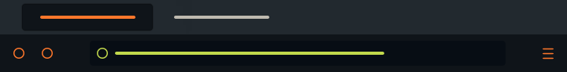<figcaption></figcaption></figure>



### Construction Blue

<figure><figcaption></figcaption></figure>



## Flag of France

<figure>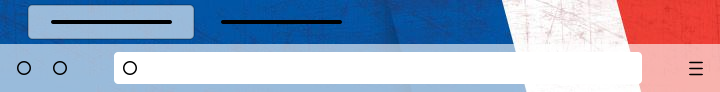<figcaption></figcaption></figure>



## Themes Animés

Les Thèmes animés pour Firefox sont assez méconnus, pourtant certains sont vraiment smoothy

### Jumping Fox

<figure>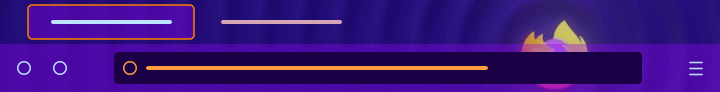<figcaption></figcaption></figure>



### Blue Scan

<figure>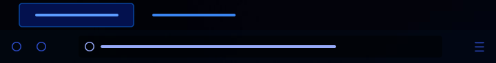<figcaption></figcaption></figure>



### Blues and Reds

<figure>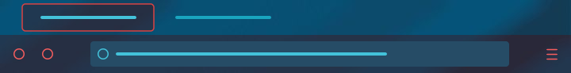<figcaption></figcaption></figure>



### Snoopy Nap

<figure>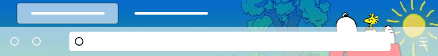<figcaption></figcaption></figure>



## A N I M A T E D KITTY CAT

<figure>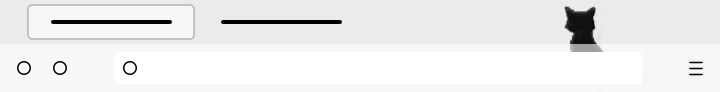<figcaption></figcaption></figure>



## Foxkeh

### Foxkeh Cloud Fixed

<figure>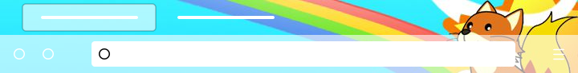<figcaption></figcaption></figure>



### Fokkeh Canoë

<figure><figcaption></figcaption></figure>



### Foxkeh Having Fun

<figure>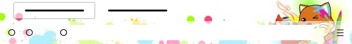<figcaption></figcaption></figure>



## Foxkeh Hanging Upside Down

<figure>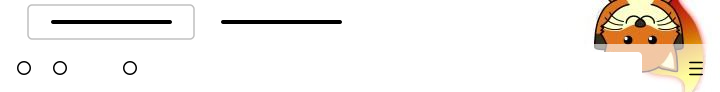<figcaption></figcaption></figure>



### Foxkeh pink

<figure>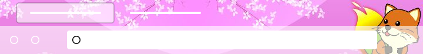<figcaption></figcaption></figure>



## Foxkeh harvest

<figure>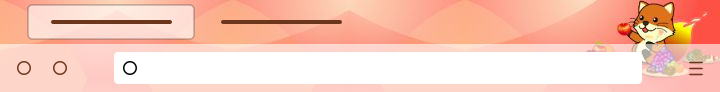<figcaption></figcaption></figure>



