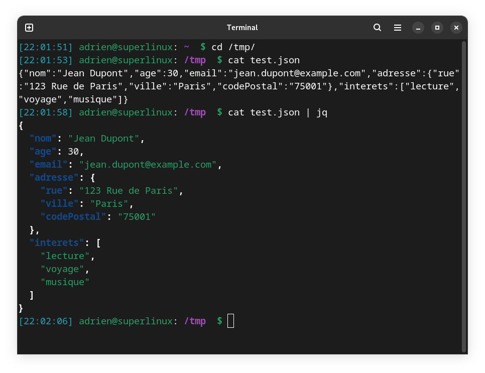

# Astuces

## Commandes de bases

**Dandified Yum** ou **DNF** est un [gestionnaire de paquets](https://fr.wikipedia.org/wiki/Gestionnaire_de_paquets). C’est le successeur de [YUM](https://fr.wikipedia.org/wiki/Yellowdog_Updater,_Modified). Pour les commandes les plus courantes, son usage est identique à celui de yum.\
\
C'est un gestinnaire de paquet basé sur RPM qui est utilisé pour installer et mettre à jour les paquets dans diverses distributions Linux tel que CentOS, RHEL et Fedora.

```bash
sudo dnf help			# Get Help
sudo dnf list available | more	# List All Packages
sudo dnf list installed 	# List Installed Packages
sudo dnf info <package>		# View Package Information
sudo dnf history                # View history transactions
sudo dnf history userinstalled  # View history transactions of user
sudo dnf repolist all		# List All Repositories
sudo dnf install <package>	# Install Package
sudo dnf reinstall <package>	# Reinstall Package
sudo dnf remove <package>	# Remove Package
sudo dnf check-update 		# Check for Updates
sudo dnf upgrade --refresh      # Update All Packages
sudo dnf update <package>	# Update Package
sudo dnf downgrade  <package>   # Downgrade Package
sudo dnf autoremove		# Remove Orphan Packages
sudo dnf distro-sync		# Synchronise All Packages
```

## Options utiles

### **Clean**

<pre class="language-bash"><code class="lang-bash"><strong>sudo dnf clean dbcache    # Effacer le cache de DNF
</strong><strong>sudo dnf clean packages   # Effacer les paquets mis en cache lors du téléchargement
</strong>sudo dnf clean plugins    # Efface le cache de tous les plugins activés
sudo dnf clean metadata   # Supprime les métadonnées du dépôt. 
<strong>sudo dnf clean all        # Effacer TOUT les caches, les métadatas &#x26; les fichiers inutiles de DNF
</strong></code></pre>

### **Activer/Désactiver un dépôt**

Si vous avez besoin d'activer un dépôt de manière permanente

<pre class="language-bash"><code class="lang-bash">sudo dnf config-manager --set-enabled &#x3C;package>    # Activer un dépôt de manière permanente
<strong>sudo dnf config-manager --set-disabled &#x3C;package>   # Désactiver un dépôt de manière permanente
</strong></code></pre>

### Installer localement un fichier .rpm

Pour installer un fichier en ligne de commande

```bash
sudo dnf localinstall <nom_du_paquet>.rpm
```

### Désinstaller une application

<pre class="language-bash"><code class="lang-bash"><strong>sudo dnf list &#x3C;nom_du_paquet>	# Rechercher un paquet - Méthode 1
</strong>sudo dnf list kernel\*		# Rechercher un paquet - Méthode 2
sudo dnf list "kernel*"		# Rechercher un paquet - Méthode 3
sudo dnf search &#x3C;mot clef>		# Rechercher un paquet - Méthode 4

sudo dnf remove &#x3C;nom du paquet>	# Supprimer un paquet
# Attention aux dépendances, bien lire ce qui est proposé à la suppression. 
</code></pre>

### **List**

```bash
sudo dnf repolist all   # Liste les dépôts installés
sudo dnf list obsoletes # Liste des paquets obsolètes (utile avant une mise à niveau de Fedora)
sudo dnf list recent    # Liste des derniers paquets ajoutés à vos dépôts
sudo dnf list extras    # Liste des paquets installés ne provenant pas des dépôts actifs ou installation manuelle
```


Source : [https://doc.fedora-fr.org/wiki/DNF,\_le\_gestionnaire\_de\_paquets\_de\_Fedora#Conclusion](https://doc.fedora-fr.org/wiki/DNF,_le_gestionnaire_de_paquets_de_Fedora#Conclusion)


***

## Raccourcis


Voici une liste de commandes de bases pour **Linux** \
(celles-ci ne sont pas spécifique à Fedora)


`CTRL + H` : afficher les fichiers/dossier cachésRenommer un fichier ou un répertoire

### Renommer un fichier ou répertoire

Voic un exemple pour renommer un fichier/répertoire du nom de "paris" en "lyon":

```bash
mv paris lyon
```

### Déplacer un fichier ou répertoire

Voici comment déplacer un fichier/répertoire du dossier courant vers le répertoire distant "/home/georges/Bureau" :

```bash
mv lyon /home/georges/Bureau
```

### Déplacer tout les fichiers/répertoires

On va déplacer tout les fichiers/répertoires du dossier courant vers le répertoire distant "/home/georges/Bureau/marseille":

```bash
mv * /home/georges/Bureau/marseille
```

### Supprime un répertoire non vide et son contenu

```bash
rm -r
```

## Connaitre la taille du disque ou répertoire

### Taille du disque&#x20;

La commande `df -h` (_disk free human-readable_) permet d’afficher à l’écran la taille de l’espace disque occupée, et la taille de l’espace disque libre de manière lisible (sans le -h la taille des fichiers serait en octet)&#x20;

Taper `df -h` pour afficher le résultat ;)

### Taille des répertoires

La commande `du -h` (_disk usage human-readable_) permet d’afficher la taille d’un répertoire et de tous les sous répertoires récursifs qu’il contient.&#x20;

1. `pwd` : pour savoir dans quel répertoire vous vous trouvez actuellement.
2. `ls` ou `tree` : pour afficher la liste des fichiers&#x20;
3. `du -h` : pour connaitre la taille occuper par les fichiers du répertoires.&#x20;
4. `du -sh .` : pour afficher le taille du répertoire (et non pas fichier par fichier)
5. `du -sh * | sort -hk1` : pour lister les répertoires, leurs tailles par ordre croissant

***

## Connaître la version du noyau Linux

Il existe plusieurs méthodes, en voici deux en passant par le terminal

la plus rapide est&#x20;

```bash
uname -r
```

Et une autre, qui permets d'avoir d'autres informations

```bash
hostnamectl
```

***

## Extraire un fichier .tar.gz

Pour extraire le fichier, il est possible de procéder de deux façons. \
Via le menu avec un simple clique-droit et extraire vers... ou en ligne de commande.

#### Extraire un fichier en ligne de commande

1. Ouvrir le terminal et naviguer dans le dossier ou se trouver le fichier
2. Utilisez l'un des commandes suivante pour extraire les fichiers :

```bash
tar -xvzf nomdufichier.tar.gz  # Décompresse les fichiers à l'aide de gzip
tar -xvjf nomdufichier.tar.bz2 # Décompresse les fichiers à l'aide de bzip2
```

Explication de  la commande :&#x20;

`tar` : La commande elle-même, la clé pour déverrouiller l'archive.\
`x` : Demande à tar d'extraire les fichiers de l'archive.\
`v` : Active la sortie verbeuse, fournissant une liste détaillée des fichiers extraits.\
`z` : Décompresse les fichiers à l'aide de `gzip`, assurant ainsi une extraction transparente.\
`j` : Décompresse les fichiers à l'aide de `bzip2`, assurant ainsi une extraction transparente.\
`f` : Spécifie le nom de fichier de l'archive, identifiant le fichier cible.

#### Exemples de commandes tar

Spécifier un répertoire de destination&#x20;

```bash
tar -xvzf nomfichier.tar.gz -C /home/user/documents
```

Cette commande extrait le contenu de nomfichier.tar.gz dans le répertoire /home/user/Documents.

### gzip vs bzip2

La principale différence entre `gzip` et `bzip2` réside dans leurs performances en termes de vitesse et de taux de compression. **Gzip** est plus rapide, mais produit des archives plus volumineuses, tandis que **bzip2** est plus lent, mais génère des archives plus petites.\
\
En général, gzip est préférable pour une utilisation courante en raison de sa rapidité, tandis que bzip2 est plus adapté à la préservation de nombreux anciens fichiers en raison de son taux de compression plus élevé.

***

## Mise à jour / Upgrade

Voici la procédure pour mettre à jour votre version de Fedora

N'oublier de faires vos backups avant ce genre d'opération.

```bash
sudo dnf upgrade --refresh
# Lancer la mise à jour, puis redémarrez votre ordinateur.
```


**Important :** Ne sautez pas cette étape. Les mises à jour du système sont nécessaires pour recevoir les clés de signature des versions supérieures, et elles corrigent souvent des problèmes liés au processus de mise à niveau.


```bash
sudo dnf install dnf-plugin-system-upgrade
# Installe le paquet dnf-plugin-system-upgrade (si celui-ci n'est pas déjà installé)

sudo dnf system-upgrade download --releasever=39
# Téléchargez les paquets mis à jour
# Votre machine va redémarrer automatiquement à la fin du processus

sudo dnf system-upgrade reboot
# Une fois le processus de mise à niveau terminé, 
# votre système redémarrera une seconde fois dans la version mise à jour de Fedora

sudo dnf system-upgrade clean
# Supprimer les métadonnées mises en cache et les transactions

sudo dnf install rpmconf
# Installe le paquet rpmconf, qui est un outil permettant de gérer les fichiers de configuration de paquets RPM.
# Ces fichiers peuvent parfois être mis à jour, et rpmconf aide à fusionner les modifications tout en conservant les réglages personnalisés.

sudo rpmconf -a
# Cette commande utilise l'outil rpmconf pour détecter les fichiers de configuration de paquets
# [...] qui ont été modifiés depuis leur installation initiale et propose des options pour les fusionner.

sudo dnf autoremove
# Supprime les paquets orphelins, c.a.d les paquets qui ont été installés en tant que dépendances pour d'autres paquets, mais qui ne sont plus nécessaires. 
# Elle permet de libérer de l'espace disque en éliminant les paquets inutilisés.
```


Source : [https://docs.fedoraproject.org/fr/quick-docs/upgrading-fedora-offline/](https://docs.fedoraproject.org/fr/quick-docs/upgrading-fedora-offline/)


***

## Carte Graphique

### Caractéristiques

Une manière pour récupérer les informations de votre carte graphique, via la commande suivante

```bash
lspci | grep -i --color 'vga\|3d\|2d'
## Exemple d'output :
# 00:02.0 VGA compatible controller: Intel Corporation CometLake-U GT2 [UHD Graphics] (rev 02)
# 01:00.0 3D controller: NVIDIA Corporation GP108BM [GeForce MX250] (rev a1)
```

ou en utilisant le paquet **`neofetch`.**

```bash
sudo dnf install neofetch    # Installer neofetch
neofetch                     # Lancer neofetch
```


Source : [https://github.com/dylanaraps/neofetch](https://github.com/dylanaraps/neofetch)


### Désinstaller drivers nvidia

Pour désinstaller les drivers nvidia, voici une commande simple

```bash
sudo dnf remove 'nvidia-*'
```

***

## Utiliser le miroir le plus rapide

Par défaut, DNF peut utiliser un miroir assez lent.  Il existe cependant une astuce pour bénéficier d'un miroir rapide. Pour cela, éditer le fichier **/etc/dnf/dnf.conf**, et copier **fastestmirror** en mettant la valeur à **true :**&#x20;

```bash
fastestmirror=true
```


Mettre fastestmirror à true ne donnera pas nécessairement des vitesses de téléchargement plus rapides car il ne vérifie que le ping (aka latence) d'un serveur et non la vitesse de téléchargement réelle. En d'autres termes, en fonction de votre localisation et peut très bien rendre DNF plus lent. C'est pour cela que l'option n'est pas activer par défaut.



Liste des mirroirs publics : [https://admin.fedoraproject.org/mirrormanager/](https://admin.fedoraproject.org/mirrormanager/)


***

## Passer en user root

Pour passer en user root sur Fedora, taper cette commande

```bash
sudo su -
```

Et le mot de passe qui va avec :)

***

## Renommer l’utilisateur

```bash
# Renommer l'utilisateur
sudo usermod -l newusername -d /home/newusername -m oldusername
sudo groupmod -n newusername oldusername

# Créer un lien symbolique (optionnel)
# Pour éviter des erreurs avec certaines applications qui pointent encore vers l'ancien dossier, 
vous pouvez créer un lien symbolique
sudo ln -s /home/newusername /home/oldusername

# Modifier le nom complet (optionnel)
sudo usermod -c "Nouveau Nom Complet" newusername
```

***

## Reset mot de passe root / session





***

## Activer le clique droit du touchpad&#x20;

Celui-ci est par défaut comme le clique gauche, ce qui est bien pénible :/


Pour régler le problème, il faudra d'abord installer **gnome-tweaks**


```bash
sudo dnf install gnome-tweaks
```

Et ensuite, taper la commande suivante

```bash
gsettings set org.gnome.desktop.peripherals.touchpad click-method 'areas'
```

***

## Créer une clé USB d’installation bootable

### Balena Etcher

<figure><figcaption></figcaption></figure>

Voici comment créer une clé USB Bootable Windows à l’aide de [balenaEtcher](https://www.balena.io/etcher#download-etcher). \
\
Il s’agit d’un flasheur USB multiplateforme disponible en téléchargement sur Windows, macOS et Linux. Flasher avec balenaEtcher est simple et facile. Il vous suffit de télécharger son fichier **AppImage** et de l’exécuter.

#### Installer Etcher


Source : [https://github.com/balena-io/etcher#redhat-rhel-and-fedora-based-package-repository-gnulinux-x86x64](https://github.com/balena-io/etcher#redhat-rhel-and-fedora-based-package-repository-gnulinux-x86x64)



Site Internet : [https://etcher.balena.io/](https://etcher.balena.io/)



Il semble qu' Etcher rencontre des problèmes à monter une image de Windows11. Plus d'informations sur [https://github.com/balena-io/etcher/issues/210](https://github.com/balena-io/etcher/issues/210)


### GNOME Disques

Même si **Etcher** est sympa, pourquoi ne pas utiliser ce bon vieux GNOME Disques ?

L'application est certes rudimentaire, mais fait le job :)

Voici la procédure :

* Ouvrez GNOME Disques en recherchant "Disques" dans le menu d'activités.
* Sélectionnez le disque ou le lecteur USB dans la colonne de gauche.
* Cliquez sur le menu en haut à droite de la fenêtre et choisissez "Restaurer l'image disque".
* Et choisissez l'emplacement ainsi que le nom du fichier pour l'image et valider


Site Internet : [https://apps.gnome.org/fr/DiskUtility/](https://apps.gnome.org/fr/DiskUtility/)


### Ventoy


Pré-requis : Avant de créer une clé USB bootable, assurez-vous de disposer de :\
\- D'une clé USB de 8 GO minimum (pour des OS comme Windows11)\
\- D'avoir télécharger en amont votre fichier ISO


#### Installation

Depuis votre terminal, voici les opérations à effectuer :&#x20;

<pre class="language-bash"><code class="lang-bash"><strong># Télécharger la dernière version de Ventoy depuis GitHub
</strong><strong>wget -O ~/ventoy.tar.gz https://github.com/ventoy/Ventoy/releases/download/v1.0.97/ventoy-1.0.96-linux.tar.gz
</strong># Extraire le fichier d'archive
tar -zxvf ventoy.tar.gz
# Ouvrir le dossier
cd ~/ventoy-1.0.97
# Lancer le GUI de Ventoy depuis son dossier
sudo ./VentoyGUI.x86_64
</code></pre>

Sélectionner votre clé USB et choisissez maintenant votre type de partition dans `option`.

Deux choix sont possibles : `MRB` and `GPT`.

<figure><figcaption></figcaption></figure>

Par défaut, Ventoy créer une clé USB avec une partition de type `MRB`. Si vous utilisez une démarrage avec boot UEFI, **sélectionner alors `GPT`**. Il s'agit de l'option recommander pour la plupart des cas.

Ensuite, procéder à l'installation de Ventoy en cliquant sur bouton `Install`, un message d'avertissement s'affichera alors pour vous signaler que vous vous appretez à effacer votre clé USB. Cliquer sur **`OK`** pour valider et continuer.

Copier maintenant votre fichier ISO dans le dossier Ventoy (celui de la clé USB)

Et voilà :)


Source : [https://github.com/ventoy](https://github.com/ventoy)



Site internet : [https://www.ventoy.net/en/index.html](https://www.ventoy.net/en/index.html)


***

## Faire une capture d'écran


Depuis Fedora 37, un raccourci est disponible dans la barre de menu


Deux méthodes possible, avec les raccourcis clavier ou avec Shutter

### Capture d'écran avec sauvegarde


Ces méthodes de capture d'écran sont automatiquement enregistrées dans le dossier "**Images**".


* `PrtScr` - une capture d'écran de l'ensemble du bureau.&#x20;
* `Alt` + `PrtScr` - une capture d'écran de la fenêtre active.&#x20;
* `⇧ Shift` + `PrtScr` - un instantané de la zone souhaitée de l'écran.

### Capture d'écran avec copie dans le presse-papiers


Ces méthodes de création d'une capture d'écran la copient dans le presse-papiers sans l'enregistrer.


* `Ctrl` + `PrtScr` - un instantané de l'ensemble du bureau.
* `Ctrl` + `Alt` + `PrtScr` - un instantané de la fenêtre du programme en cours.
* `Ctrl` + `⇧ Shift` + `PrtScr` - un instantané de la zone souhaitée de l'écran.


Source : [https://fedoramagazine.org/take-screenshots-on-fedora/](https://fedoramagazine.org/take-screenshots-on-fedora/)


### Avec Shutter (logiciel de capture d'écran)

Vous pouvez sinon utliser une gestionner de capture d'écran. \
**Shutter** est un excellent outil en la matière tout comme _Greenshot_ sur Windows.

```bash
sudo dnf install shutter    # Install Shutter
sudo dnf upgrade shutter    # Upgrade Shutter
```


Source : [https://www.fosslinux.com/39264/install-screenshot-tool-shutter-fedora.htm](https://www.fosslinux.com/39264/install-screenshot-tool-shutter-fedora.htm)l


***

## Rendre persistant votre Dock


Deux solutions possibles


Vous pouvez utiliser l'extension GNOME [Dash-to-Panel](https://extensions.gnome.org/extension/1160/dash-to-panel/) ou bien installer la [version Budgie](https://fedoraproject.org/spins/budgie/) de Fedora (il s'agit d'une version Spin)

***

## Changer votre fond d'écran via le terminal

Parfois il arrive, que le changement de votre fond d'écran (wallpaper) pose problème via l'interface graphique. Afin de changer le changer quand même, lancer cette commande dans le terminal :&#x20;

```bash
gsettings set org.gnome.desktop.background picture-uri file:///home/<user>/Images/image.jpg
```


Penser juste à remplacer dans le terminal le bon lien de l'image


***

## Changer le serveur d'affichage&#x20;

(exemple : Wayland > XORG)


Ce type de changement est parfois nécéssaire quand certaines applications ne fonctionnent pas correctement au niveau de l'affichage (ex: le partage d'écran de Discord via Wayland fait un écran noir, du coup il faut changer le serveur d'affichage sur XORG et c'est bon :)


#### Ecran de connexion

* Vérifiez le système de fenêtrage actuellement utilisé : allez dans **Paramètres** et sélectionnez **À propos** > **Système de fenetrage.**
* Sur l'écran de connexion, sélectionner l'icône ⚙️ et définir **GNOME sur Xorg.**
* Ouvrez votre session, normalement le système de fenêtrage XORG (X11) sera utilisé.
* Pour vérifier, retournez dans **Paramètres** et sélectionnez **À propos** > **Système de fenetrage.**
* Pas de panique, votre changement persistera après une déconnexion ou un redémarrage

#### Editer le fichier de configuration

Changer la session GNOME par défaut en éditant le fichier de configuration

Ouvrez /etc/gdm/custom.conf et décommentez la ligne :&#x20;

```bash
WaylandEnable=false
```

Ajoutez la ligne suivante à la section \[daemon]&#x20;

```bash
DefaultSession=gnome-xorg.desktop 
```

Sauvegardez le fichier custom.conf.

Déconnectez-vous ou redémarrez pour entrer dans la nouvelle session.


Pour plus d'informations : [https://docs.fedoraproject.org/fr/quick-docs/configuring-xorg-as-default-gnome-session/](https://docs.fedoraproject.org/fr/quick-docs/configuring-xorg-as-default-gnome-session/)


***

## Editer votre Grub

Pour personnaliser votre grub, une des solutions est d'utiliser **Grub optimizer**.

```bash
sudo dnf install grub-customizer
```

***

## Kernel Devel

Le paquet kernel-devel contient les fichiers d'en-têtes du noyau, des fichiers permettant au développeur d'accéder aux différentes fonctionnalités du noyau . De façon plus simple, il est nécessaire au développement et à la compilation de pilotes.

```bash
sudo dnf in kernel-devel
```


Source : [https://www.reddit.com/r/Fedora/comments/nl6arp/how\_do\_i\_install\_kernel\_headers\_for\_fedora/](https://www.reddit.com/r/Fedora/comments/nl6arp/how_do_i_install_kernel_headers_for_fedora/)


***

## Faire un Dig

#### Introduction

La commande **dig** signifie **Domain Information Groper,** il collecte des données sur les serveurs de noms de domaine. **Dig** est utile pour résoudre les problèmes DNS


Dig n’est pas une commande de base Linux.


#### Installation

```bash
sudo dnf install bind bind-utils
```

### DNS

Une recherche du DNS

```bash
dig lewifi.fr
```

### DNS ipv4 & ipv6

Une recherche du DNS avec ipv4 & ipv6 en une seule commande

```bash
dig www.lewifi.fr A www.lewifi.fr AAAA +short
```

Source : Source: [http://linux.die.net/man/1/dig](http://linux.die.net/man/1/dig) -- under the 'Multiple Queries' section

### Provider Mail

Permets d'identifier quel est le provider mail d'un nom de domaine

```bash
dig auchan.fr MX
# auchan.fr.  600 IN  MX  1 aspmx.l.google.com. --> Google Workspace
```

### Recherche depuis un serveur DNS


Par défaut, **Dig** utilise la configuration locale (/etc/resolv.conf) pour décider quel serveur de noms utiliser. Il est possible de lui spécifier un autre résolveur DNS comme celui de Quad9


```bash
dig @9.9.9.9 www.lewifi.fr
```

### Recherche DNS avec option Trace


L’option **+trace** répertorie chaque serveur différent que la requête passe jusqu’à sa destination finale. Pratique pour identifier l’adresse IP où le trafic tombe


```bash
dig www.lewifi.fr +trace
```

***

## Tweaks

Description

Fedy est un outil graphique qui vous permet de modifier votre système Fedora en quelques clics. Des applications normales aux thèmes, en passant par les diverses modifications du système, Fedy peut faire presque tout ce dont vous pouvez avoir besoin sur Fedora.


Pour installer Fedy sur la dernière version de Fedora, assurez-vous que vous avez que vous avez déjà activé les dépôts RPM Fusion


#### Installation

```bash
sudo dnf copr enable kwizart/fedy
sudo dnf install fedy -y
```


Source : [https://fosspost.org/things-to-do-after-installing-fedora-37/](https://fosspost.org/things-to-do-after-installing-fedora-37/)


***

## Vérifier chiffrements d'un serveur

Voici une astuce pour vérifier les chiffrements supportés par le serveur en utilisant NMAP.

Notez que l'utilisation de Nmap pour scanner des systèmes sans autorisation peut être contraire aux politiques de sécurité et aux lois, donc assurez-vous d'avoir la permission avant de scanner des systèmes qui ne vous appartiennent pas.

#### Installation de nmap

```bash
sudo dnf install nmap
```


Source : [https://nmap.org/download.html#linux-rpm](https://nmap.org/download.html#linux-rpm)


#### Commande nmap

Après avoir installé NMAP, vous pouvez exécuter cette commande.\
Vous aurez la liste des ciphers qui s'afficheront

```bash
nmap sV --script ssl-enum-cipherss -p 443 google.com <mydomain.com>
```

Le résultat de cette commande donnera des informations sur les suites de chiffrement SSL/TLS prises en charge par le serveur sur le port 443 (TLS)

#### Explications des composants de la commande :

* `nmap`: C'est l'outil de balayage réseau.
* `--script ssl-enum-ciphers`: Cela indique à Nmap d'exécuter le script spécifique `ssl-enum-ciphers`, qui est conçu pour analyser les suites de chiffrement SSL/TLS prises en charge par un serveur.
* `-p 443`: Cela spécifie le port à scanner, dans ce cas, le port 443, qui est le port par défaut pour les connexions HTTPS.
* `mydomain.com` : C'est le nom de domaine ou l'adresse IP du serveur à scanner.


Source : [https://nmap.org/nsedoc/scripts/ssl-enum-ciphers.html](https://nmap.org/nsedoc/scripts/ssl-enum-ciphers.html)


***

### Mettre en forme un fichier JSON ou YAML de façon lisible avec de la coloration syntaxique depuis le terminal

#### Installation de jq

```bash
sudo dnf install jq
```


Source : [https://jqlang.github.io/jq](https://jqlang.github.io/jq/)


Exemple : &#x20;

<figure><figcaption></figcaption></figure>

#### Installation de yq

Sur Fedora, vous pouvez installer yq via Snapcraft

```bash
sudo dnf install snapd		      # Enable Snapd
sudo ln -s /var/lib/snapd/snap /snap  # Enable classic snap support, enter the following to create a symbolic link
sudo snap install yq		      # Install yq
```


Source : [https://github.com/mikefarah/yq/#install](https://github.com/mikefarah/yq/#install)


***

## Cron et crontab (planificateur de tâches)

#### Installation

```bash
sudo dnf install cronie
```

#### Configuration

Pour être autorisé à utiliser la commande **crontab**, il faut que l'utilisateur soit présent dans le groupe **cron**.\
Les fichiers **/etc/cron.allow** et **/etc/cron.deny** permettent de définir les droits d'utilisation sur crontab.\
Si le fichier /etc/cron.allow existe, alors vous devez être présent dans ce fichier pour être autorisé à utiliser cette commande.

#### Syntaxe

Manière schématique de la syntaxe à respecter d'un **crontab**

```bash
# Example of job definition:
# .---------------- minute (0 - 59)
# |  .------------- hour (0 - 23)
# |  |  .---------- day of month (1 - 31)
# |  |  |  .------- month (1 - 12) OR jan,feb,mar,apr ...
# |  |  |  |  .---- day of week (0 - 6) (Sunday=0 or 7) OR sun,mon,tue,wed,thu,fri,sat
# |  |  |  |  |
# *  *  *  *  *  user command to be executed
```

#### Commandes

```bash
crontab -l # Afficher la liste des actions
crontab -r # Supprimer toutes les actions
crontab -e # crontab -e
```


Source : [https://www.linuxtricks.fr/wiki/cron-et-crontab-le-planificateur-de-taches](https://www.linuxtricks.fr/wiki/cron-et-crontab-le-planificateur-de-taches)


***

## Vérifier l'état de sa batterie

Il est possible de vérifier l'état de sa batterie en cas de doute

**Vérifie l'état de la batterie avec les commandes suivantes :**

* `acpi -V | grep Battery`
* `upower -i /org/freedesktop/UPower/devices/battery_BAT0`&#x20;

Ces deux commandes exploitent les interfaces de gestion de l’alimentation propres à Linux (ACPI et UPower), qui sont indispensables à la gestion de la batterie, de la mise en veille, et de l’économie d’énergie sur un portable

### **1. `acpi -V | grep Battery`**

* `acpi` est un utilitaire qui s’appuie sur l’**ACPI** (Advanced Configuration and Power Interface), la norme qui permet à l’ordinateur et au système d’exploitation de communiquer l’état de l’énergie (batterie, branchement secteur, température, etc.)
* L’option `-V` affiche toutes les informations disponibles (état batterie, adaptateur secteur, ventilation, température…).
* `| grep Battery` filtre les lignes contenant le mot « Battery » pour n’afficher que les informations concernant la **batterie**.

### **2. `upower -i /org/freedesktop/UPower/devices/battery_BAT0`**

* `upower` est un outil qui fait partie de l’infrastructure moderne de gestion d’énergie sous Linux (via le service UPower).
* L’option `-i` suivie du chemin d’un périphérique UPower affiche tous les détails sur ce périphérique.\
  Ce chemin (`/org/freedesktop/UPower/devices/battery_BAT0`) correspond à la batterie principale (souvent nommée BAT0, mais certains portables ont plusieurs batteries).

_Cette commande donne une vision très détaillée et technique de l’état de santé et du statut de ta batterie, en s’appuyant sur l’infrastructure UPower (fréquemment utilisée dans les distributions Linux GNOME/KDE modernes)_.

***

