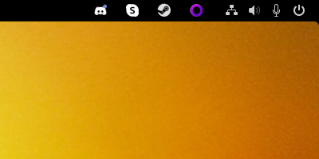

# Ext. GNOME

## GNOME Extensions

#### Description

[GNOME Extensions](https://gitlab.gnome.org/GNOME/gnome-shell-extensions) est une petite application pour gérer les extensions Shell de GNOME.


Source : [https://docs.fedoraproject.org/fr/quick-docs/gnome-shell-extensions/](https://docs.fedoraproject.org/fr/quick-docs/gnome-shell-extensions/)


### GNOME Extensions

#### Description

Si **GNOME Extensions** n'est n'est pas déjà installé sur votre système GNOME, vous pouvez l'installer via un paquet Flatpak

#### Installation

```bash
# Installer FlatHub
flatpak remote-add --if-not-exists flathub https://dl.flathub.org/repo/flathub.flatpakrepo

# Installer GNOME Extensions
flatpak install flathub org.gnome.Extensions

# MLancer GNOME Extensions
flatpak run org.gnome.Extensions
```


Source : [https://flathub.org/apps/details/org.gnome.Extensions](https://flathub.org/apps/details/org.gnome.Extensions)


### GNOME Shell Browser Integration

#### Description

Pour installer des extensions GNOME depuis votre navigateur

#### Installation

```bash
sudo dnf install gnome-browser-connector
```


Site Internet : [https://wiki.gnome.org/Projects/GnomeShellIntegration/Installation](https://wiki.gnome.org/Projects/GnomeShellIntegration/Installation)



Source : [https://packages.fedoraproject.org/pkgs/gnome-browser-connector/gnome-browser-connector/](https://packages.fedoraproject.org/pkgs/gnome-browser-connector/gnome-browser-connector/)


### Téléchargement

Les extensions sont disponibles en téléchargement depuis le site [GNOME Extensions](https://extensions.gnome.org/).


Les extensions sont également disponibles depuis Fedora Packages : [https://packages.fedoraproject.org/search?query=gnome-shell-extension\&start=0](https://packages.fedoraproject.org/search?query=gnome-shell-extension\&start=0)


***

## Extensions

### Vitals

Vitals est une extension de GNOME Shell pour afficher la température, la tension, la vitesse du ventilateur, l'utilisation de la mémoire, la charge de traitement, les ressources du système, la vitesse du réseau et les statistiques de stockage dans la barre de menu supérieure de votre GNOME Shell.

<figure><figcaption></figcaption></figure>

#### Installation

```bash
sudo dnf install libgtop2-devel lm_sensors
```

#### Activation

Rendez-vous ensuite sur [le site web de Gnome Extensions](https://extensions.gnome.org/extension/1460/vitals/), recherchez **Vitals** et cliquez sur l'icône switch.


À ce stade, Vitals devrait fonctionner. Si vous inversez les étapes 1 et 2 ci-dessus, vous devrez redémarrer votre session en vous déconnectant, puis à nouveau.



Source : [https://github.com/corecoding/Vitals](https://github.com/corecoding/Vitals)


***

### Dash to Dock for COSMIC

Un fork de Dash to Dock. Un dock pour bureau sur Linux.

<figure><figcaption></figcaption></figure>

#### Installation & Activation

Rendez-vous sur [le site web de Gnome Extensions](https://extensions.gnome.org), recherchez [**Dash to Dock for COSMIC**](https://extensions.gnome.org/extension/5004/dash-to-dock-for-cosmic/) et cliquez sur l'icône switch.


Source : [https://github.com/halfmexican/dash-to-dock-pop/tree/ubuntu-dock](https://github.com/halfmexican/dash-to-dock-pop/tree/ubuntu-dock)


***

### Media Controls

Affiche les contrôles et les informations du média en cours de lecture dans le panneau.

<figure><figcaption></figcaption></figure>

#### Installation

```bash
sudo dnf install gnome-shell-extension-mediacontrols
```

#### Activation

Rendez-vous ensuite sur le [site web de Gnome Extensions](https://extensions.gnome.org/), recherchez [**Media Controls**](https://extensions.gnome.org/extension/4470/media-controls/) et cliquez sur l'icône switch.


Source : [https://github.com/cliffniff/media-controls/](https://github.com/cliffniff/media-controls/blob/main/README.md)


***

### NVIDIA GPU Stats Tool <a href="#extension_name" id="extension_name"></a>

Affiche les statistiques du GPU NVIDIA dans la barre d'outils.&#x20;


Pré-requis : Nécessite [nvidia-settings](https://download.nvidia.com/XFree86/Linux-x86_64/396.51/README/nvidiasettings.html) ou [nvidia-smi](https://download.nvidia.com/XFree86/Linux-x86_64/396.51/README/nvidia-smi.html).



Inclut le support de [Bumblebee](https://www.bumblebee-project.org/).


<figure><figcaption></figcaption></figure>

#### Activation

Rendez-vous sur le site web de [Gnome Extensions](https://extensions.gnome.org/), recherchez [**Nvidia GPU Stats Tool**](https://extensions.gnome.org/extension/1320/nvidia-gpu-stats-tool) et cliquez sur l'icône switch.


Source : [https://github.com/ethanwharris/gnome-nvidia-extension](https://github.com/ethanwharris/gnome-nvidia-extension)


***

### Clipboard Indicator

Extension du gestionnaire du presse-papiers pour Gnome.\
Ajoute un indicateur du presse-papiers dans le panneau supérieur et met en cache l'historique du presse-papiers.

<figure><figcaption></figcaption></figure>

#### Installation

#### Option 1 - Installation via git

L'installation via git s'effectue en clonant le dépôt dans votre répertoire local des extensions de gnome-shell (généralement \~/.local/share/gnome-shell/extensions/)

```bash
git clone https://github.com/Tudmotu/gnome-shell-extension-clipboard-indicator.git <extensions-dir>/clipboard-indicator@tudmotu.com
```

Après avoir cloné le repo, l'extension est pratiquement installée mais désactivée. \
Afin de l'activer, exécutez la commande suivante :

```bash
gnome-extensions enable clipboard-indicator@tudmotu.com
```

#### Option 2 - Installation depuis GNOME Extensions

Rendez-vous sur le site web de [Gnome Extensions](https://extensions.gnome.org/), recherchez **Clipboard Indicator** et cliquez sur l'icône switch.


Source : [https://github.com/Tudmotu/gnome-shell-extension-clipboard-indicator](https://github.com/Tudmotu/gnome-shell-extension-clipboard-indicator)


***

### Just Perfection GNOME Shell Extension

Désactiver les éléments de l'interface utilisateur de GNOME, modifier le comportement et personnaliser votre bureau GNOME.

<figure><figcaption></figcaption></figure>

#### Activation

Rendez-vous sur le site web de [Gnome Extensions](https://extensions.gnome.org/extension/3843/just-perfection/), recherchez [**Just Perfection**](https://extensions.gnome.org/extension/3843/just-perfection/) et cliquez sur l'icône switch


Source : [https://gitlab.gnome.org/jrahmatzadeh/just-perfection](https://gitlab.gnome.org/jrahmatzadeh/just-perfection)


***

### Tray Icons: Reloaded <a href="#extension_name" id="extension_name"></a>

Ramène les icônes de plateau au panneau supérieur, avec des fonctionnalités supplémentaires.\


<figure><figcaption></figcaption></figure>

#### Activation

Rendez-vous sur le site web de [Gnome Extensions](https://extensions.gnome.org/extension/2890/tray-icons-reloaded/), recherchez [Tray Icons: Reloaded](https://app.gitbook.com/s/Pp6PcTwYyYLWwFxkG4Q4/the-basics/change-requests) et cliquez sur l'icône switch


Source : [https://github.com/MartinPL/Tray-Icons-Reloaded](https://github.com/MartinPL/Tray-Icons-Reloaded)

