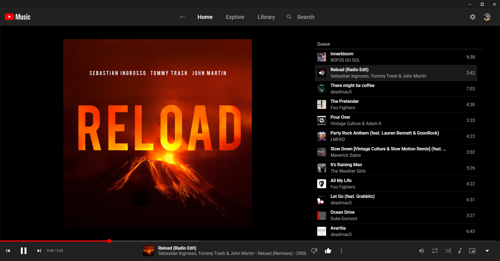

# Audio

## GNOME Podcasts

<figure><figcaption></figcaption></figure>

Il s'agit d'une application qui est un client de podcast pour les ordinateurs de bureau Linux, intégrant parfaitement l'interface GNOME. Cette application permet d'écouter ses podcasts préférés à partir de son ordinateur, de lire différents formats audio et de se souvenir de l'endroit où l'on s'est arrêté.\
\
Elle offre également la possibilité de s'abonner à des émissions via des liens RSS/Atom, iTunes et Soundcloud, et d'importer des abonnements à partir d'autres applications via des fichiers OPML

#### Installation

```bash
flatpak install flathub org.gnome.Podcasts # Installer GNOME Podcasts
flatpak run org.gnome.Podcasts             # Lancer GNOME Podcasts
```


Source : [https://gitlab.gnome.org/World/podcasts](https://gitlab.gnome.org/World/podcasts)



Site internet : [https://flathub.org/apps/org.gnome.Podcasts](https://flathub.org/apps/org.gnome.Podcasts)


***

## YouTube Music Desktop

<figure><figcaption></figcaption></figure>

Il n'existe pas d'application de bureau officielle pour YouTube Music à l'heure actuelle.\
Cependant, il existe des alternatives tierces telles que l'application YouTube Music Desktop, qui permet d'écouter de la musique sur le bureau sans avoir besoin d'un onglet de navigateur ouvert.


Il ne s'agit pas d'une version officiel maintenu par Google


### Installation via Snapcraft


Pré-requis : **Snapd** est nécéssaire


```bash
sudo dnf install snapd
```

```bash
sudo ln -s /var/lib/snapd/snap /snap
sudo snap install youtube-music-desktop-app
```


Source : [https://snapcraft.io/install/youtube-music-desktop-app/fedora](https://snapcraft.io/install/youtube-music-desktop-app/fedora)


### Installation avec un paquet RPM


Vérifier la denrière version en date sur [https://github.com/th-ch/youtube-music/releases](https://github.com/th-ch/youtube-music/releases)


#### Télécharger le fichier RPM le plus récent

```bash
wget https://github.com/th-ch/youtube-music/releases/download/v1.18.0/youtube-music-1.18.0.x86_64.rpm
```

#### Installation du paquet

```bash
sudo dnf install https://github.com/th-ch/youtube-music/releases/download/v1.18.0/youtube-music-1.18.0.x86_64.rpm
```

***

## Foobar2000

<figure><figcaption></figcaption></figure>

Foobar2000 est un lecteur audio avancé et gratuit. Le logiciel prend en charge une grande variété de formats audio, tels que MP3, MP4, AAC, Vorbis, Opus, FLAC, WavPack, WAV, AIFF, Musepack, et offre des fonctionnalités avancées telles que la lecture sans interruption, le support complet de ReplayGain, des raccourcis clavier et des effets DSP.


Foobar2000 n'est pas nativement pris en charge sur Linux, car il est développé pour la plateforme Windows.



Il est toutefois possible de l'installer sur Fedora, via un portage en passant par **Snapd** est nécéssaire


```bash
sudo dnf install snapd
```

```bash
sudo ln -s /var/lib/snapd/snap /snap
sudo snap install foobar2000
```


Source : [https://snapcraft.io/install/foobar2000/fedora](https://snapcraft.io/install/foobar2000/fedora)

