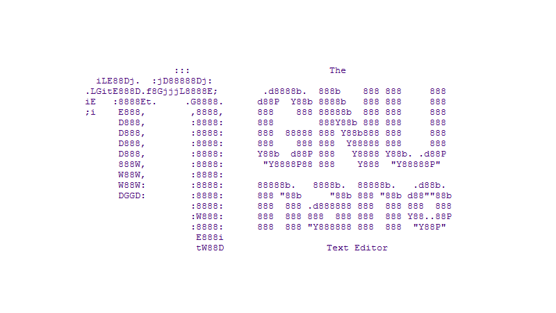
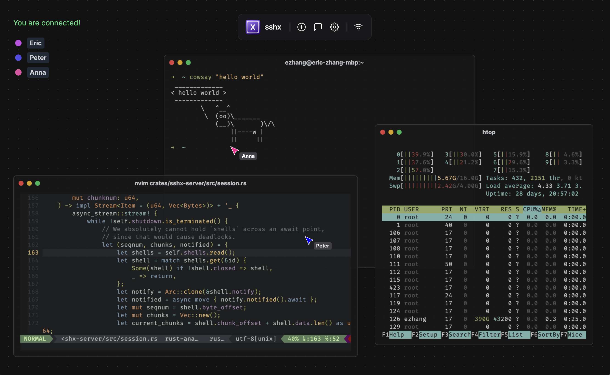

# Terminal

## Shell

#### Vérifier la version du shell

```bash
bash --version        # Check Bash version
zsh --version         # Check ZSH version
fish --version        # Check fish version
gnome-shell --version # Check GNOME version
```


Source : [https://askcodez.com/comment-trouver-ma-version-de-shell-a-laide-de-commande-de-linux.html](https://askcodez.com/comment-trouver-ma-version-de-shell-a-laide-de-commande-de-linux.html)


### Changer le shell par défaut


Pour changer de shell, un utilisateur doit exécuter la commande **chsh** et préciser où se trouve son nouveau shell.


```bash
sudo dnf install util-linux-user    # install chsh
cat /etc/shells			    # list all the shells from your system
chsh				    # change the shell for your user
/bin/zsh			    # Example: change the shell Bash to ZSH
```


Source : [https://www.linuxuprising.com/2021/01/how-to-change-default-shell-in-linux.html](https://www.linuxuprising.com/2021/01/how-to-change-default-shell-in-linux.html)


### Remplacer Bash par Zsh&#x20;

<figure><figcaption><p>Zsh logo</p></figcaption></figure>

#### **Description**

**Zsh** (abréviation de **Z Shell**) est un programme shell riche en fonctionnalités pour les systèmes d'exploitation de type Unix (dont Linux est un dérivé) avec de nombreuses fonctionnalités.\
Il s'agit d'une version étendue du **Bourne Shell (sh).** L'intérêt de _Zsh_ par rapport à la plupart des autres commandes cd, l'extension de chemin récursif et la correction orthographique et la sélection interactive de fichiers et de répertoires.

Zsh se trouvat dans les référentiels Fedora et peut être installé avec la commande dnf suivante.

#### Installation de ZSH

```bash
sudo dnf install zsh
```


Source : [https://sourceforge.net/projects/zsh/files/](https://sourceforge.net/projects/zsh/files/)


***

## Oh-My-ZSH (OMZ)

<figure><figcaption><p>Oh my Zsh logo</p></figcaption></figure>

**Oh My Zsh** est un framework pour ZSH, il fournit de nombreux thèmes et plugins (support de PHP, Python, PostgreSQL ...). Ci-dessous, sont présents ceux que j'utilise.&#x20;


A découvrir, une liste de plugins pour OMZ réalisé par Unixorn : \
[https://github.com/unixorn/awesome-zsh-plugins#oh-my-zsh](https://github.com/unixorn/awesome-zsh-plugins#oh-my-zsh)


Pour l'installer, lancer la commande suivante :&#x20;

```bash
curl -L https://raw.github.com/robbyrussell/oh-my-zsh/master/tools/install.sh | sh
```

Une fois "Oh My Zsh" d'installé, il suffit de redémarrer ZSH pour prendre en compte les changements. (CTRL + D puis "zsh")


Source : [https://www.it-connect.fr/passer-de-bash-a-zsh/](https://www.it-connect.fr/passer-de-bash-a-zsh/)


#### Activer les mise à jour de Oh-My-ZSH

Il est possible de mettre à jour OMZ de deux façons, manuellement ou de façon automatique\
\
**Mise à jour manuel**

```bash
omz update
```

**Mise à jour automatique**

```shell
zstyle ':omz:update' mode auto	    # Activer mise à jour automatique
zstyle ':omz:update' mode disabled  # Désactiver mise à jour automatique
```


Source : [https://github.com/ohmyzsh/ohmyzsh#getting-updates](https://github.com/ohmyzsh/ohmyzsh#getting-updates)


## Thèmes OMZ

Il existe plusieurs thèmes pour OMZ, voici comme installer deux d'entre eux (agnoster et powerlevel10K)


La liste complète est thèmes est [disponible ici](https://github.com/robbyrussell/oh-my-zsh/wiki/Themes).


### Agnoster

1 - Ouvrir le fichier `.zhrc`

```bash
open ~/.zshrc
```

2 - Changer le thème par défaut

Parcourez votre fichier afin de trouver cette ligne `ZSH_THEME` et ajouter `agnoster`

```bash
ZSH_THEME="agnoster"
```

3 - Mettre à jour le fichier de config ZSH

```bash
source ~/.zshrc
```

### Powerlevel10K

Avant de procéder à l'installation du thème **Powerlevel10K**, il est fortement reccomander d'installer la polices d'écriture **Meslo Nerd Font** pour une meilleur confort.

**Pré-requis : Meslo Nerd Font**

1. Télécharger Meslo Nerd Font (fichiers ttf)

* [MesloLGS NF Regular.ttf](https://github.com/romkatv/powerlevel10k-media/raw/master/MesloLGS%20NF%20Regular.ttf)
* [MesloLGS NF Bold.ttf](https://github.com/romkatv/powerlevel10k-media/raw/master/MesloLGS%20NF%20Bold.ttf)
* [MesloLGS NF Italic.ttf](https://github.com/romkatv/powerlevel10k-media/raw/master/MesloLGS%20NF%20Italic.ttf)
* [MesloLGS NF Bold Italic.ttf](https://github.com/romkatv/powerlevel10k-media/raw/master/MesloLGS%20NF%20Bold%20Italic.ttf)

2. Installer les fonts sur votre système

Double-cliquer sur chaque fichier, et cliquer "Install". Cela installera `MesloLGS NF` sur votre système.

3. Définir la police d'écriture dans votre Terminal ou IDE

* **Visual Studio Code**: Ouvrir _Fichiers → Préférences → Paramètres_ (PC) ou _Code → Préférences → Paramètres_ (Mac), et taper `terminal.integrated.fontFamily` dans la barre de recherche présente en haut de l'onglet _Préférences_ et basculer la valeur sur `MesloLGS NF`. Vous pouvez consulter [ce screenshot](https://raw.githubusercontent.com/romkatv/powerlevel10k-media/389133fb8c9a2347929a23702ce3039aacc46c3d/visual-studio-code-font-settings.jpg) pour voir ce que cela doit donner.
* **GNOME Terminal** / **Tilix** (le terminal par défaut de Fedora): Ouvrir le _Terminal → Préférences_ et sélectionner un profil . Rechercher _Custom font_ sous _Text Appearance_ et sélectionner`MesloLGS NF Regular`

**Installation de Powerlevel10K**

1 - Cloner le répertoire suivant

```bash
git clone --depth=1 https://github.com/romkatv/powerlevel10k.git ${ZSH_CUSTOM:-$HOME/.oh-my-zsh/custom}/themes/powerlevel10k
```

2 - Ouvrir le fichier .zhrc

```bash
open ~/.zshrc
```

3 - Changer le thème par défaut

Parcourez votre fichier afin de trouver cette ligne ZSH\_THEME et ajouter `powerlevel10k`

```bash
ZSH_THEME="powerlevel10k/powerlevel10k"
```

4 - Mettre à jour le fichier de config ZSH

```bash
source ~/.zshrc
```


Source : [https://github.com/romkatv/powerlevel10k#oh-my-zsh](https://github.com/romkatv/powerlevel10k#oh-my-zsh)


### Plugins

Voici deux plugins très utile pour OMZ que j'utilise au quotidien :

* [zsh-syntax-highlighting](https://github.com/zsh-users/zsh-syntax-highlighting/tree/master) : un plugin pour rendre la syntax plus agréable à lire
* [zsh-autosuggestions](https://github.com/zsh-users/zsh-autosuggestions) : un plugin de suggestion d'autocomplétion

**1 -** Pour les installer, cloner ces répertoires dans le dossier plugins de oh-my-zsh. \
Par défaut celui-ci si trouve ici : `~/.oh-my-zsh/custom/plugins`)

```bash
git clone https://github.com/zsh-users/zsh-syntax-highlighting.git ${ZSH_CUSTOM:-~/.oh-my-zsh/custom}/plugins/zsh-syntax-highlighting  # zsh-syntax-highlighting
git clone https://github.com/zsh-users/zsh-autosuggestions ${ZSH_CUSTOM:-~/.oh-my-zsh/custom}/plugins/zsh-autosuggestions              # zsh-autosuggestions
```

**2 -** Ouvrir le fichier .zhrc

```bash
open ~/.zshrc
```

**3 -** Ajouter vos plugins à ceux existant. \
Parcourez votre fichier afin de trouver cette ligne plugins=( et remplacer par :&#x20;

```
plugins=(
   git
   zsh-syntax-highlighting
   zsh-autosuggestions
)
```

**3 -** Mettre à jour le fichier de config ZSH

```bash
source ~/.zshrc
```


Sources : [https://github.com/zsh-users/zsh-syntax-highlighting/blob/master/INSTALL.md](https://github.com/zsh-users/zsh-syntax-highlighting/blob/master/INSTALL.md) & [https://github.com/zsh-users/zsh-autosuggestions/blob/master/INSTALL.md](https://github.com/zsh-users/zsh-autosuggestions/blob/master/INSTALL.md)


***

## Warp

<figure><figcaption></figcaption></figure>

#### Description

Warp est un émulateur de terminal écrit en **Rust**.\
\
Il se distingue par des fonctionnalités telles que Warp Drive pour le partage de commandes entre équipes, Warp AI pour les suggestions et l'assistance des commandes, ainsi qu'un IDE moderne avec une sélection de texte et un positionnement du curseur.

#### Installation

La manière la plus simple d'installer Warp est de télécharger et d'installer [le paquet rpm](https://app.warp.dev/download?package=rpm).\
Après le téléchargement, vous pouvez installer le paquet avec :

```bash
sudo dnf install ./.rpm
```

L'installation du paquetage .rpm configurera automatiquement le dépôt yum de Warp. Lors de la première mise à jour, dnf récupérera la clé de signature nécessaire pour vérifier l'intégrité des paquets téléchargés.


Source : [https://github.com/warpdotdev/Warp](https://github.com/warpdotdev/Warp)



Site web : [https://www.warp.dev](https://www.warp.dev)


***

## TMUX

<figure><figcaption></figcaption></figure>

#### **Description**

**tmux** est un multiplexeur de terminaux libre en mode texte. Il permet d'utiliser plusieurs terminaux virtuels dans une seule fenêtre de terminal ou une session sur un terminal distant. tmux peut être détaché d'une session et continuer de fonctionner en arrière-plan, on peut également s'y rattacher plus tard. [Wikipédia](https://fr.wikipedia.org/wiki/Tmux)

#### Installation

```bash
sudo dnf -y install tmux
```


Site web : [https://fedoramagazine.org/use-tmux-more-powerful-terminal/](https://fedoramagazine.org/use-tmux-more-powerful-terminal/)


### Liste de raccourcis

`tmux ls` : voir la liste liste des tmux actifs

`tmux new -s mysession` : démarrer une nouvelle session avec un nom

`tmux a -t mysession` : se connecter à votre dernière session qui porte un nom

### Cheatsheet


Tmux Cheat Sheet : [https://tmuxcheatsheet.com](https://tmuxcheatsheet.com/)


***

## Dog

<figure><figcaption><p>Dog screenshot</p></figcaption></figure>

#### **Description**

dog est un client DNS en ligne de commande comme dig. Il utilise une syntax colorée qui comprend la syntaxe normale des arguments en ligne de commande. Le client supporte les protocoles DNS-over-TLS et DNS-over-HTTPS, et peut émettre du JSON.


Site web : [https://github.com/ogham/dog](https://github.com/ogham/dog)&#x20;


#### Installation

Sur Fedora, vous pouvez installer dog via Snapcraft ou manuellement

#### Installation via Snap

```bash
sudo dnf install snapd		      # Enable Snapd
sudo ln -s /var/lib/snapd/snap /snap  # Enable classic snap support, enter the following to create a symbolic link
sudo snap install dog		      # Install dog
```


Source : [https://snapcraft.io/install/dog/fedora](https://snapcraft.io/install/dog/fedora)


#### Installation manuelle

Installer `gcc`, `tar`, et les librairies SSL nécéssaire : `libssl` or `openssl`.

```bash
sudo dnf install gcc tar openssl-devel
```


Note : You may need to update your system’s version of the GNU C library (glibc).


Installer maintenant [**Rust**](https://www.rust-lang.org/). Il vous sera utile pour complier le code source de `dog` :

```bash
curl --proto =https --tlsv1.2 -sSf https://sh.rustup.rs | sh
```

Lorsque le terminal vous le proposer, sélectionner `1` pour procéder à l'installation dans le dossier par défaut. Après avoir redémarrer votre terminal, taper la commande suivante :

```bash
source $HOME/.cargo/env
```

Naviguer dans la [release page](https://github.com/ogham/dog/releases/) de `dog`, identifier la version la plus récente, et copier l'URL du ficher `.tar.gz`. Télécharger le fichier en remplacant par l'URL que vous venez de copier

```bash
curl -LO https://github.com/ogham/dog/archive/refs/tags/v0.1.0.tar.gz
```

Décompresser les fichers du l'archive `.tar.gz` file, et entrez dans le répertoire extrait. \
Remplacez le nom de fichier ci-dessous par celui du fichier que vous avez téléchargé. \
De même, remplacez le nom du répertoire par celui du fichier extrait :

```bash
tar -xvzf v0.1.0.tar.gz  # Extract the .tar.gz file
cd dog-0.1.0             # Open directory
```

Avant de lancer le build, lancer cette commande pour mettre à jour les dépendances de Cargo

```bash
cargo update # Update dependencies
```

Lancer le build avec Cargo pour générer le fichier binaire de `dog`:

```bash
cargo build --release  # Build project
```

Copier le fichier binaire dans le dossier `bin` de l'utilisateur :

```bash
sudo cp target/release/dog /usr/local/bin  # Copy the resulting binary into your current user’s PATH
```

Vérifier votre installation en identifiant la version de `dog` installer

```bash
dog --version # checking the installed version of dog
```


Source : [https://www.linode.com/docs/guides/use-dog-linux-dns-client/](https://www.linode.com/docs/guides/use-dog-linux-dns-client/)


***

## Cyberduck CLI

<figure><figcaption></figcaption></figure>

#### **Description**

Un outil de transfert de fichiers qui s'exécute dans votre shell sous Linux & OS X ou votre invite de ligne de commande Windows. Modifiez des fichiers sur des serveurs distants, téléchargez, chargez et copiez entre des serveurs avec FTP, SFTP ou WebDAV, ainsi que la prise en charge des déploiements de stockage dans le cloud Amazon S3 et OpenStack Swift.

#### Installation

```bash
echo -e "[duck-stable]\nname=duck-stable\nbaseurl=https://repo.cyberduck.io/stable/\$basearch/\nenabled=1\ngpgcheck=0" | sudo tee /etc/yum.repos.d/duck-stable.repo
sudo yum install duck
```


Source & Site web : [https://duck.sh/](https://duck.sh/)


***

## **MTR (**_**My Traceroute**_**)**

#### **Description**

Un outil de diagnostic de réseau en ligne de commande qui fournit les fonctions des commandes **Ping** et **Traceroute**.

#### Installation

```bash
sudo dnf install mtr
```


Source : [https://github.com/traviscross/mtr](https://github.com/traviscross/mtr)



Site web : [https://www.bitwizard.nl/mtr](https://www.bitwizard.nl/mtr/)


***

## VIM

<figure><figcaption></figcaption></figure>

#### Description

VIM permets de lire et d'éditer des fichiers depuis votre terminal.\
Pas facile à prendre en main :D

#### Installation

<pre class="language-bash"><code class="lang-bash"><strong>sudo dnf install vim        # VIM CLI version
</strong><strong>sudo dnf install vim-X11    # VIM vith GUI features
</strong></code></pre>


Source : [https://fedoraproject.org/wiki/Vim](https://fedoraproject.org/wiki/Vim)



Site web : [https://www.vim.org](https://www.vim.org/download.php)


### Liste de raccourcis

`:q!` or `ZQ` - quitter et abandonner les modifications non sauvegardée


Vim Cheatsheet : [https://vim.rtorr.com/lang/fr\_fr](https://vim.rtorr.com/lang/fr_fr)


#### Faire une modification sur un fichier

1. Rechercher la valeur à modifier : `/<value>`
2. Faire une insertion : `i`
3. Changer la valeur
4. Quitter la saisie vim : `exit`
5. Sauvegarder et quitter vim : `:wq`

#### Mouvement du curseur

* `k` - déplacer le curseur vers le **haut** ⬆️
* `j` - déplacer le curseur vers le **bas** `⬇️`
* `h` - déplacer le curseur vers la **gauche** ⬅️
* `l` - déplacer le curseur vers la **droite** ➡️
* `H` - déplacement vers le **haut** de l'écran ⬆️
* `M` - déplacement vers le **milieu** de l'écran&#x20;
* `L` - déplacement vers le **bas** de l'écran `⬇️`
* `gg` - aller à la **première ligne** du document ⏫
* `G` - aller à la **dernière ligne** du document ⏬

***

## GNU nano

<figure><figcaption></figcaption></figure>

#### **Description**

GNU nano permet de lire et d'éditer des fichiers depuis votre terminal mais de façon plus accessible que VIM.

#### Installation

```bash
sudo dnf install nano
```


Source : [https://www.nano-editor.org/git.php](https://www.nano-editor.org/git.php)



Site web : [https://www.nano-editor.org/](https://www.nano-editor.org/)


### Liste de raccourcis

Toutes les commandes sont préfixées avec soit `^` ou `M`.&#x20;

* Le symbole caret (`^`) représente la touche`Ctrl` de vote clavier.&#x20;
* La lettre `M`représente la touche `Alt` de votre clavier.

Par exemple, pour `^J`les commandes signifient que l'appui sur `Ctrl`et `J` en même temps.

#### Sélectionner du texte

Pour sélectionner du texte, le copier et le coller :

1. Se déplacer avec les flèches ↑ ↓ ← → pour se placer à l'endroit voulu,
2. Faire Alt+A pour marquer le début de la sélection,
3. Se déplacer avec les flèches ↑ ↓ ← → pour sélectionner la zone de texte à copier,
4. Copier cette sélection avec Alt+^,
5. Se déplacer à l'endroit voulu pour le collage,
6. Coller avec Ctrl+U.

#### Raccourcis utiles

* `CTRL` + `A` : Permet d’aller au début de la ligne
* `CTRL` + `E` : Permet d’aller à la fin de la ligne
* `CTRL` + `Y` : Permet de remonter de page en page
* `CTRL` + `V` : Permet de descendre de page en page
* `CTRL` + `_` : Permet de se rendre au n° de ligne indiqué
* `CTRL` + `C` : Permet de savoir à quel n° de ligne / colonne / caractère se trouve votre curseur
* `CTRL` + `W` : Permet de faire une recherche
* `CTRL` + `D` : Permet de supprimer un caractère
* `CTRL` + `K` : Permet de supprimer une ligne complète (comme la commande dd sous Vi)
* `CTRL` + `O` : Permet de sauvegarder votre fichier
* `CTRL` + `X` : Permet de quitter nano
* `CTRL` + `G` : Affiche l’aide

***

## curl

<figure><figcaption></figcaption></figure>

#### Description

cURL (_client URL request library_) est une [interface en ligne de commande](https://fr.wikipedia.org/wiki/Interface_en_ligne_de_commande), destinée à récupérer le contenu d'une ressource accessible sur internet. Il peut être utilisé en tant que client REST. cURL implémente l'interface utilisateur et repose sur la bibliothèque logicielle `libcurl`

#### Installation

```bash
sudo dnf install curl
```


Source : [https://github.com/curl/curl](https://github.com/curl/curl)



Site web : [https://curl.se/](https://curl.se/)


***

## Htop

<figure><figcaption></figcaption></figure>

#### Description

**htop** est un moniteur système pour les systèmes d’exploitation type Unix très similaire à **top**, qui fonctionne également en mode Terminal, mais qui dispose d'un environnement en mode texte plus convivial que ce dernier.

**Installation**

```bash
sudo dnf install htop
```


Source : [https://htop.dev/downloads.html](https://htop.dev/downloads.html)


***

## Btop++

<div data-full-width="false"><figure><figcaption></figcaption></figure></div>

#### Description

Une alternative plus graphique à `top` ou `htop`

#### Installation

<pre class="language-bash"><code class="lang-bash"><strong>sudo dnf install btop
</strong></code></pre>


Source : [https://github.com/aristocratos/btop](https://github.com/aristocratos/btop?ref=itsfoss.com)



Des thèmes sont également disponible : [https://github.com/aristocratos/btop](https://github.com/aristocratos/btop?ref=itsfoss.com#themes)


***

## GPing

<figure><figcaption></figcaption></figure>

#### Description

Une alternative graphique et plus complète (multipe hosts par exemple) à la commande `ping`

Après l'installation, lancer `gping` \<domaine.tld>

#### Installation

```bash
sudo dnf copr enable atim/gping -y && sudo dnf install gping
```


Source : [https://github.com/orf/gping](https://github.com/orf/gping)


***

## EZA

<figure><figcaption></figcaption></figure>

<figure><figcaption></figcaption></figure>

#### Description

`eza` est une alternative moderne du programme de listage de fichiers `ls`. \
Il utilise des couleurs pour distinguer les types de fichiers et les métadonnées. Il connaît les liens symboliques, les attributs étendus et Git ! Enfin, il est petit, rapide et ne comporte qu'un seul binaire :)

Après l'installation, lancer `eza` à la place de commande `ls`.

Pour connaitre la liste complète des raccourcis, taper `eza --help`

#### Installation

```bash
sudo dnf install eza
```


Source : [https://github.com/eza-community/eza/blob/main/INSTALL.md#fedora](https://github.com/eza-community/eza/blob/main/INSTALL.md#fedora)



Site internet : [https://eza.rocks](https://eza.rocks/)


### Liste de raccourcis

<pre class="language-bash"><code class="lang-bash"><strong># La Base
</strong><strong>eza -l             # Vue liste
</strong>eza -l -T          # Vue liste avec arborescence

# Eléments
eza -l --grid      # Vue liste en colonnes
eza -l --icons     # Vue liste avec icones
eza -l --hyperlink # Vue liste avec hyperlien
eza -l --header    # Vue liste avec le header
eza -l --blocksize # Vue liste avec la taille des fichiers
eza -l --time-style "+%d/%m/%Y" # Vue liste avec la taille des fichiers

# Combinaisons (exemples)
eza -l --icons --hyperlink --header --blocksize --time-style "+%d/%m/%Y"    # Vue liste
eza -T -l --icons --hyperlink --header --blocksize --time-style "+%d/%m/%Y" # Vue liste avec avec arborescence

# GIT
eza -l --icons --hyperlink --header --time-style "+%d/%m/%Y" --git
eza -l --icons --hyperlink --header --time-style "+%d/%m/%Y" --git --git-repos-quotes'
</code></pre>

***

## Arsenal


<figure><figcaption></figcaption></figure>

<figure><figcaption></figcaption></figure>

Un outil pour créez un inventaire de vos commandes Linux favorites

```bash
# Installation avec pip
python3 -m pip install arsenal-cli

# Installation manuelle
git clone https://github.com/Orange-Cyberdefense/arsenal.git
cd arsenal
python3 -m pip install -r requirements.txt
./run

# Inside your .bashrc or .zshrc add the path to run to help you do that you could launch the addalias.sh script
./addalias.sh

# Lancer l'application
arsenal               
```


Source : [https://github.com/Orange-Cyberdefense/arsenal](https://github.com/Orange-Cyberdefense/arsenal)


***

## sshx

<figure><figcaption></figcaption></figure>

#### Description

`sshx`est une solution pour partager votre terminal en expérience collaborative. Vous pourrez ainsi partager votre terminal aussi facilement qu’un document Google Docs, avec un simple lien.

#### Installation

```bash
curl -sSf https://sshx.io/get | sh
```


Source : [https://github.com/ekzhang/sshx](https://github.com/ekzhang/sshx)



Site internet : [https://sshx.io/](https://sshx.io/)

