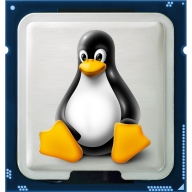
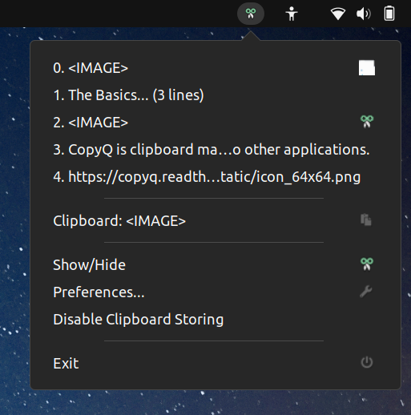

# Utilitaires

## CPU-X

<figure><figcaption></figcaption></figure>

#### Description

Il s'agit d'un **logiciel gratuit qui recueille des informations sur le processeur, la carte mère etc.** CPU-X est similaire à [CPU-Z](https://es.wikipedia.org/wiki/CPU-Z) (_Windows_), à la différence que celui-ci est un logiciel libre et open source conçu pour GNU / Linux.

#### Installation

```bash
sudo dnf install cpu-x
```


Source : [https://github.com/TheTumultuousUnicornOfDarkness/CPU-X](https://github.com/TheTumultuousUnicornOfDarkness/CPU-X)



Site internet : [https://thetumultuousunicornofdarkness.github.io/CPU-X/](https://thetumultuousunicornofdarkness.github.io/CPU-X/)


***

## P7zip

<figure><figcaption></figcaption></figure>

#### Description

[p7zip](http://p7zip.sourceforge.net/) est un portage de [7-Zip](http://www.7-zip.org/) pour les systèmes [POSIX](http://fr.wikipedia.org/wiki/POSIX) incluant GNU/Linux. \
Il permet entre autres d'extraire les archives ZIP, GZIP, TAR, GZIP, DEB et RPM.

#### Installation

```bash
sudo dnf install p7zip
```


Les sources linux de 7zip sont disponible ici : [https://www.7-zip.org/download.html](https://www.7-zip.org/download.html)


***

## GParted

<figure><figcaption></figcaption></figure>

#### Description

Parmi les différents éditeurs de partitions pour Linux, ma préférance va pour GParted. \
Il est multi-plateforme (Linux, Windows, Mac OS X) et simple d'utilisation. Il même possible d'en faire une version Live CD/USB. Bien pratique pour dépanner.

#### Installation

```bash
su -c "yum install gparted"
```


Source : [https://gparted.org/download.php](https://gparted.org/download.php)


***

## GPaste

#### Description

Il s'agit d'une extension qui permet aux utilisateurs de gérer le contenu et l’historique du presse-papier, grâce à une icône située dans le panel supérieur de gnome. Vous pourrez ainsi copier rapidement du texte, des url, des images, des lignes de commande et tout un tas d’autres choses.

#### Mise à jour du cache


Télécharger d'abord et mettre en cache les fichiers de métadonnées du référentiel


```bash
sudo dnf makecache --refresh
```

#### Installation

Ensuite, procéder à l'installation

```bash
sudo dnf -y install gpaste
```


Source : [https://installati.one/fedora/34/gpaste/](https://installati.one/fedora/34/gpaste/)


***

## KolourPaint

<figure><figcaption></figcaption></figure>

#### Description

KolourPaint est logiciel de dessin simple qui permet de créer rapidement des images. Il est pratique pour retoucher ou modifier simplement des images.

#### Installation via Flatpak

```bash
flatpak install flathub org.kde.kolourpaint
```

#### Installation via Snapcraft


Pré-requis : **Snapd** est nécéssaire


```bash
sudo dnf install snapd
```

```bash
sudo ln -s /var/lib/snapd/snap /snap
sudo snap install kolourpaint
```


Source : [https://apps.kde.org/fr/kolourpaint/](https://apps.kde.org/fr/kolourpaint/)



Site internet : [https://www.kolourpaint.org/](https://www.kolourpaint.org/)


***

## FileZilla

<figure><figcaption></figcaption></figure>

Il s'agit d'un client FTP, FTPS et SFTP, développé sous la licence publique générale GNU.

<pre class="language-bash"><code class="lang-bash"><strong>sudo dnf install filezilla
</strong></code></pre>


Source : [https://filezilla-project.org/download.php](https://filezilla-project.org/download.php?show_all=1)


***

## VirtualBox

<figure><figcaption></figcaption></figure>

#### Description

Édité et distribué gratuitement pour une utilisation personnelle par _Oracle_, VirtualBox est un **hyperviseur type 2** permettant de créer une machine virtuelle en quelques clics.

#### Installation


Ce guide d'installation est pour la version 36 de Fedora


```bash
## Recommended to perform OS upgrade before you install VirtualBox #
sudo dnf -y upgrade
sudo reboot

## Install Dependencies
sudo dnf -y install @development-tools
sudo dnf -y install kernel-headers kernel-devel dkms elfutils-libelf-devel qt5-qtx11extras

## Add VirtualBox RPM repository
cat <<EOF | sudo tee /etc/yum.repos.d/virtualbox.repo 
[virtualbox]
name=Fedora $releasever - $basearch - VirtualBox
baseurl=http://download.virtualbox.org/virtualbox/rpm/fedora/36/\$basearch
enabled=1
gpgcheck=1
repo_gpgcheck=1
gpgkey=https://www.virtualbox.org/download/oracle_vbox.asc
EOF

## Import VirtualBox GPG Key
sudo dnf search virtualbox

## Install VirtualBox 7.0 on Fedora 36
sudo dnf install VirtualBox-7.0

## Add your user to the vboxusers group
sudo usermod -a -G vboxusers $USER
newgrp vboxusers
id $USER
uid=1000(jmutai) gid=1000(jmutai) groups=1000(jmutai),10(wheel),976(vboxusers)

## Launch VirtualBox
virtualbox
```


Source : [https://computingforgeeks.com/how-to-install-virtualbox-on-fedora-linux/](https://computingforgeeks.com/how-to-install-virtualbox-on-fedora-linux/)


***

## Bleachbit

<figure><figcaption></figcaption></figure>

#### Description

Un utilitaire open-source pour libérer le cache, supprimer les cookies, effacer l'historique d'Internet, déchiqueter des fichiers temporaires, supprimer des journaux etc. \
Disponible sur Linux et Windows.

#### Téléchargement


Site internet : [https://www.bleachbit.org/download](https://www.bleachbit.org/download)


***

## Stacer

<figure><figcaption></figcaption></figure>

#### Description

Un utilitaire d'optimisation et de monitoring graphique open-source pour Linux sou la forme d'un tableau de bord. Il sera par exemple possible de voir la charge en mémoire, CPU, disque et réseau mais également de gérer les applications et les processus qui se lancent au démarrage, de faire un peu de ménage dans vos logs et fichiers temporaires (cache, corbeille).

#### Téléchargement


Site internet : [https://github.com/oguzhaninan/Stacer/releases](https://github.com/oguzhaninan/Stacer/releases)


***

## AnyDesk

<figure><figcaption></figcaption></figure>

#### Description

Un Teamviewer like open-source propulsé en Rust

#### Installation

```bash
sudo cat > /etc/yum.repos.d/AnyDesk-Fedora.repo << "EOF" 
[anydesk]
name=AnyDesk Fedora - stable
baseurl=http://rpm.anydesk.com/fedora/$basearch/
gpgcheck=1
repo_gpgcheck=1
gpgkey=https://keys.anydesk.com/repos/RPM-GPG-KEY
EOF

sudo dnf install anydesk
```


Source : [http://rpm.anydesk.com/howto.html](http://rpm.anydesk.com/howto.html)



Site internet : [http://www.anydesk.com](http://www.anydesk.com)


***

## CopyQ

<figure><figcaption></figcaption></figure>

#### Description

CopyQ est un gestionnaire de presse-papiers avancé avec de puissantes fonctionnalités d'édition et de script.

#### Installation

<pre class="language-bash"><code class="lang-bash"><strong>sudo dnf install copyq
</strong></code></pre>


Source : [https://copyq.readthedocs.io/en/latest/build-source-code.html](https://copyq.readthedocs.io/en/latest/build-source-code.html)



Site internet : [https://github.com/hluk/CopyQ](https://github.com/hluk/CopyQ)


***

## Solaar

<figure><figcaption></figcaption></figure>

#### Description

Un utilitaire open-source avec une interface graphique pour gérer les périphériques de marques Logitech utilisant un dongle usb [Unifying](https://en.wikipedia.org/wiki/Logitech_Unifying_receiver), Bolt, Lightspeed, ou Nano; ou en connexion directe via un câble USB cable; ou encore par connexion Bluetooth.

#### Installation&#x20;

```bash
sudo dnf install solaar
```


Source : [https://github.com/pwr-Solaar/Solaar](https://github.com/pwr-Solaar/Solaar)



Site internet : [https://pwr-solaar.github.io/Solaar/](https://pwr-solaar.github.io/Solaar/)


***

## Catfish

<figure><figcaption></figcaption></figure>

#### Description

Le logiciel Catfish sur Linux est un outil de recherche de fichiers.\
\
C'est une application légère et simple qui vous permet de raffiner votre recherche en utilisant des critères tels que le temps, le type de fichier, etc. Il peut rechercher des fichiers n'importe où sur votre système, y compris dans les partitions montées, et même à l'intérieur des fichiers, y compris les PDF. \
\
De plus, il offre la possibilité de rechercher dans des fichiers compressés (.zip, .odt et .docx) et dans les fichiers cachés.

#### Installation&#x20;

<pre class="language-bash"><code class="lang-bash"><strong>sudo dnf install catfish
</strong></code></pre>


Source : [https://gitlab.xfce.org/apps/catfish](https://gitlab.xfce.org/apps/catfish)



Site internet : [https://git.xfce.org/apps/catfish/about/](https://git.xfce.org/apps/catfish/about/)


***

## WoeUSB-ng

<figure><figcaption></figcaption></figure>

#### Description

Un outil permettant de créer votre propre clé usb à partir d'une image iso ou d'un vrai DVD. \
Il s'agit d'une réécriture de WoeUSB original.

#### Installation

<pre class="language-bash"><code class="lang-bash"><strong>sudo pip3 install WoeUSB-ng
</strong></code></pre>


Source : [https://github.com/WoeUSB/WoeUSB-ng](https://github.com/WoeUSB/WoeUSB-ng)



Site internet :&#x20;


***

## Fastfetch&#x20;

#### Description

**Fastfetch** est un utilitaire en ligne de commande conçu pour afficher rapidement et efficacement des informations système de base sur votre terminal. Développé en C, il est plus léger et rapide que des alternatives comme **neofetch** ou **screenfetch**

#### Installation

```bash
sudo dnf install fastfetch
```


Source : [https://github.com/fastfetch-cli/fastfetch](https://github.com/fastfetch-cli/fastfetch)

