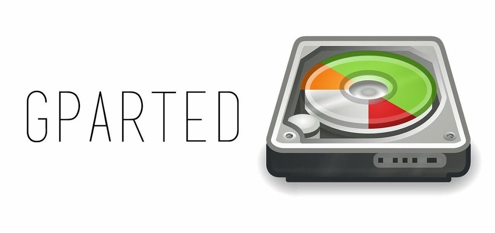

# Utilitaires

## CPU-X

Il s'agit d'un **logiciel gratuit qui recueille des informations sur le processeur, la carte mère etc.** CPU-X est similaire à [CPU-Z](https://es.wikipedia.org/wiki/CPU-Z) (_Windows_), à la différence que celui-ci est un logiciel libre et open source conçu pour GNU / Linux.





#### Installation

```bash
sudo dnf install cpu-x
```

***

## DUF

DUF est un utilitaire en ligne de commande qui permet d’afficher l’espace disque disponible sur Linux et Windows dans un terminal. C'est une alternative améliorée à la commande de base `df`



#### Installation

#### **Étape 1 : Téléchargement du paquet RPM**

Ouvrez votre navigateur web et allez sur la[ page des releases de duf](https://github.com/muesli/duf) sur GitHub.

Recherchez la version la plus récente de duf et téléchargez le fichier RPM correspondant à votre architecture (généralement `linux_amd64.rpm` pour les systèmes x86\_64).

#### **Étape 2 : Installation du paquet**

Ouvrez un terminal.

Naviguez jusqu'au répertoire où vous avez téléchargé le fichier RPM. Par exemple, si le fichier est dans le dossier `Téléchargements`, utilisez la commande :

```
cd ~/Téléchargements
```

Installez le paquet RPM avec la commande suivante :

```
sudo rpm -i duf_0.6.2_linux_amd64.rpm
```

Remplacez `duf_0.6.2_linux_amd64.rpm` par le nom exact du fichier que vous avez téléchargé.

**Étape 3 : Vérification de l'installation**

Pour vérifier que l'installation s'est bien déroulée, exécutez la commande suivante dans le terminal :

```bash
duf --version
```

Si l'installation a réussi, vous devriez voir la version de duf installée s'afficher :)

#### Utilisation de duf

Maintenant que duf est installé, vous pouvez l'utiliser pour vérifier l'utilisation de l'espace disque

```bash
duf
```

***

## P7zip

[p7zip](http://p7zip.sourceforge.net/) est un portage de [7-Zip](http://www.7-zip.org/) pour les systèmes [POSIX](http://fr.wikipedia.org/wiki/POSIX) incluant GNU/Linux. \
Il permet entre autres d'extraire les archives ZIP, GZIP, TAR, GZIP, DEB et RPM.

#### Installation

```bash
sudo dnf install p7zip
```



***

## GParted

<figure><figcaption></figcaption></figure>

#### Description

Parmi les différents éditeurs de partitions pour Linux, ma préférance va pour GParted. \
Il est multi-plateforme (Linux, Windows, Mac OS X) et simple d'utilisation. Il même possible d'en faire une version Live CD/USB. Bien pratique pour dépanner.

#### Installation

```bash
su -c "yum install gparted"
```



***

## GPaste

#### Description

Il s'agit d'une extension qui permet aux utilisateurs de gérer le contenu et l’historique du presse-papier, grâce à une icône située dans le panel supérieur de gnome. Vous pourrez ainsi copier rapidement du texte, des url, des images, des lignes de commande et tout un tas d’autres choses.

#### Mise à jour du cache


Télécharger d'abord et mettre en cache les fichiers de métadonnées du référentiel


```bash
sudo dnf makecache --refresh
```

#### Installation

Ensuite, procéder à l'installation

```bash
sudo dnf -y install gpaste
```



***

## KolourPaint

KolourPaint est logiciel de dessin simple qui permet de créer rapidement des images. Il est pratique pour retoucher ou modifier simplement des images.





#### Installation via Flatpak

```bash
flatpak install flathub org.kde.kolourpaint
```

#### Installation via Snapcraft


Pré-requis : **Snapd** est nécéssaire


```bash
sudo dnf install snapd
```

```bash
sudo ln -s /var/lib/snapd/snap /snap
sudo snap install kolourpaint
```

***

## FileZilla

Il s'agit d'un client FTP, FTPS et SFTP, développé sous la licence publique générale GNU.

<pre class="language-bash"><code class="lang-bash"><strong>sudo dnf install filezilla
</strong></code></pre>



***

## VirtualBox

Édité et distribué gratuitement pour une utilisation personnelle par _Oracle_, VirtualBox est un **hyperviseur type 2** permettant de créer une machine virtuelle en quelques clics.



#### Installation


Ce guide d'installation est pour la version 36 de Fedora


```bash
## Recommended to perform OS upgrade before you install VirtualBox #
sudo dnf -y upgrade
sudo reboot

## Install Dependencies
sudo dnf -y install @development-tools
sudo dnf -y install kernel-headers kernel-devel dkms elfutils-libelf-devel qt5-qtx11extras

## Add VirtualBox RPM repository
cat <<EOF | sudo tee /etc/yum.repos.d/virtualbox.repo 
[virtualbox]
name=Fedora $releasever - $basearch - VirtualBox
baseurl=http://download.virtualbox.org/virtualbox/rpm/fedora/36/\$basearch
enabled=1
gpgcheck=1
repo_gpgcheck=1
gpgkey=https://www.virtualbox.org/download/oracle_vbox.asc
EOF

## Import VirtualBox GPG Key
sudo dnf search virtualbox

## Install VirtualBox 7.0 on Fedora 36
sudo dnf install VirtualBox-7.0

## Add your user to the vboxusers group
sudo usermod -a -G vboxusers $USER
newgrp vboxusers
id $USER
uid=1000(jmutai) gid=1000(jmutai) groups=1000(jmutai),10(wheel),976(vboxusers)

## Launch VirtualBox
virtualbox
```

***

## Bleachbit

Un utilitaire open-source pour libérer le cache, supprimer les cookies, effacer l'historique d'Internet, déchiqueter des fichiers temporaires, supprimer des journaux etc. \
Disponible sur Linux et Windows.



***

## Stacer

Un utilitaire d'optimisation et de monitoring graphique open-source pour Linux sou la forme d'un tableau de bord. Il sera par exemple possible de voir la charge en mémoire, CPU, disque et réseau mais également de gérer les applications et les processus qui se lancent au démarrage, de faire un peu de ménage dans vos logs et fichiers temporaires (cache, corbeille).

#### Téléchargement



***

## RustDesk

Un logiciel de contrôle de bureau à distance, écrit en Rust. Fonctionne sans configuration. \
Vous avez le contrôle de vos données, sans se soucier de la sécurité. \
\
Il est possible d'utiliser un serveur relais mis à disposition par rustdesk, de l'auto-heberger avec le serveur de démonstration ou d'écrire votre propre serveur relais.



#### Installation

```html
Installation avec le paquet RPM : https://github.com/rustdesk/rustdesk/releases > Fedora
```



***

## CopyQ

CopyQ est un gestionnaire de presse-papiers avancé avec de puissantes fonctionnalités d'édition et de script.



#### Installation

<pre class="language-bash"><code class="lang-bash"><strong>sudo dnf install copyq
</strong></code></pre>



***

## Solaar

Un utilitaire open-source avec une interface graphique pour gérer les périphériques de marques Logitech utilisant un dongle usb [Unifying](https://en.wikipedia.org/wiki/Logitech_Unifying_receiver), Bolt, Lightspeed, ou Nano; ou en connexion directe via un câble USB cable; ou encore par connexion Bluetooth.



#### Installation&#x20;

```bash
sudo dnf install solaar
```



***

## Catfish

Le logiciel Catfish sur Linux est un outil de recherche de fichiers.\
\
C'est une application légère et simple qui vous permet de raffiner votre recherche en utilisant des critères tels que le temps, le type de fichier, etc. Il peut rechercher des fichiers n'importe où sur votre système, y compris dans les partitions montées, et même à l'intérieur des fichiers, y compris les PDF. \
\
De plus, il offre la possibilité de rechercher dans des fichiers compressés (.zip, .odt et .docx) et dans les fichiers cachés.





#### Installation&#x20;

<pre class="language-bash"><code class="lang-bash"><strong>sudo dnf install catfish
</strong></code></pre>

***

## WoeUSB-ng

Un outil permettant de créer votre propre clé usb à partir d'une image iso ou d'un vrai DVD. \
Il s'agit d'une réécriture de WoeUSB original.



#### Installation

<pre class="language-bash"><code class="lang-bash"><strong>sudo pip3 install WoeUSB-ng
</strong></code></pre>

***

## Fastfetch&#x20;

#### Description

**Fastfetch** est un utilitaire en ligne de commande conçu pour afficher rapidement et efficacement des informations système de base sur votre terminal. Développé en C, il est plus léger et rapide que des alternatives comme **neofetch** ou **screenfetch**



#### Installation

```bash
sudo dnf install fastfetch
```

***

## SquirrelDisk

**SquirrelDisk** est une alternative à la référence DAISYDISK, mais cette fois-ci, gratuit et disponible sur Windows, Linux et MacOS. En un clic, l'outil permet de localiser facilement les fichiers volumineux qui occupent inutilement de l’espace



#### Installation


