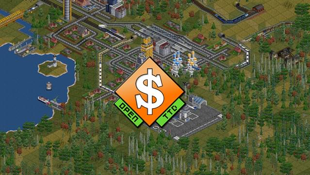

# Jouer sur Linux

## Lutris

####

<figure><figcaption></figcaption></figure>

#### Description

Lutris est un gestionnaire de jeux FOSS (libre, gratuit et open source) pour les systèmes d'exploitation basés sur Linux développé et maintenu par Mathieu Comandon et la communauté.&#x20;

Lutris vous donnera accès à l’ensemble de vos jeux vidéo, ou tout du moins ceux accessibles sur PC. Grâce à une interface unique, vous pouvez installer et lancer n’importe quel jeu disponible dans vos librairies **Steam**, **Epic Games** ou **GOG** par exemple.

#### Installation

```bash
sudo dnf install lutris
```


Source : [https://lutris.net/downloads](https://lutris.net/downloads)


***

## OpenRCT2

<figure><figcaption></figcaption></figure>

OpenRCT2 est un jeu vidéo de simulation de construction et de gestion qui simule la gestion d'un parc d'attractions. Il s'agit d'une réimplémentation et d'une extension gratuites et open-source du jeu vidéo **RollerCoaster Tycoon 2** de 2002.

#### Installation des dépendances

```bash
sudo dnf install gcc gcc-c++ json-devel \\
openssl-devel SDL2-devel libicu-devel \\
speexdsp-devel libcurl-devel \\
cmake fontconfig-devel freetype-devel \\
libpng-devel libzip-devel mesa-libGL-devel \\
duktape-devel
```

#### Compiler le jeu

```bash
git clone --depth=1 https://github.com/OpenRCT2/OpenRCT2.git && cd ./OpenRCT2 && mkdir build && cd build && cmake ../ && make
```

#### Paramétrages des fichiers

```bash
cp -r ../data/ ./data/ && make g2 && mv ./g2.dat ./data/g2.dat
```

#### Sélection du dossier d'installation pour le jeu

```bash
openrct2 set-rct2 /path/to/rct2-install
```


Source : [https://openrct2.org/quickstart/install/linux/fedora](https://openrct2.org/quickstart/install/linux/fedora)


***

## OpenTTD

<figure><figcaption></figcaption></figure>

**OpenTTD** est un jeu vidéo de « gestion et planification urbanistique » dans lequel le joueur a pour but de gagner de l'argent par transport de passagers et du fret sur route, rail, eau et dans l'air. Il est une réécriture libre du jeu original Transport Tycoon Deluxe de Chris Sawyer, sorti en 1995. [Wikipédia](https://fr.wikipedia.org/wiki/OpenTTD)

#### Installation via Snapcraft


Pré-requis : **Snapd** est nécéssaire


```bash
sudo dnf install snapd
```

```bash
sudo ln -s /var/lib/snapd/snap /snap
sudo snap install openttd
```


Source : [https://snapcraft.io/install/openttd/fedora](https://snapcraft.io/install/openttd/fedora)



Site internet : [https://www.openttd.org/](https://www.openttd.org/)


