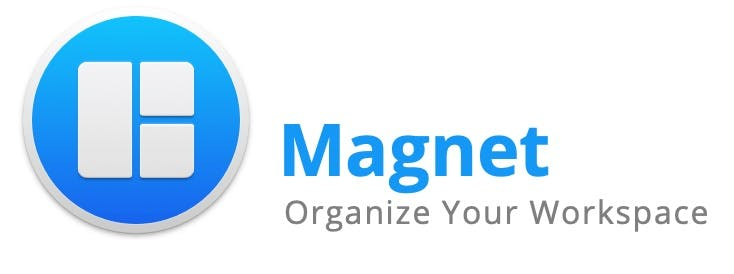
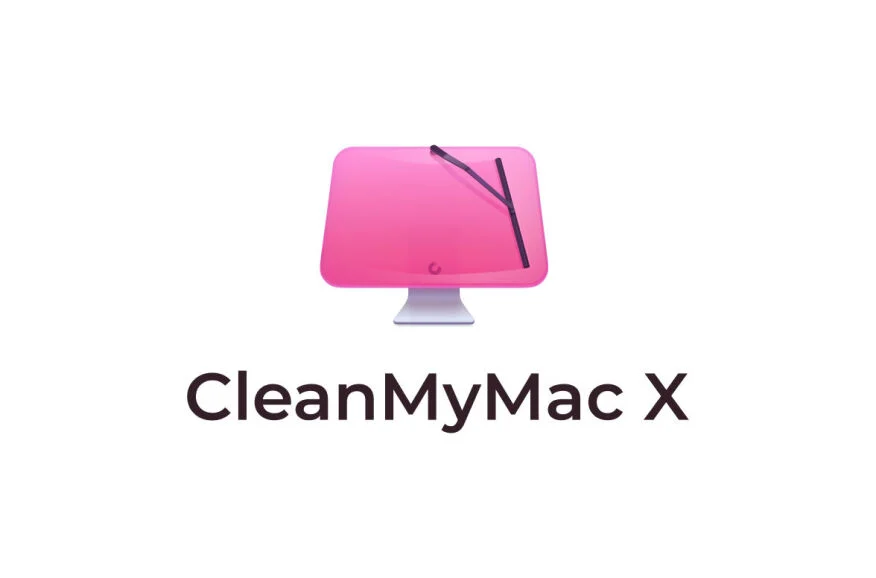
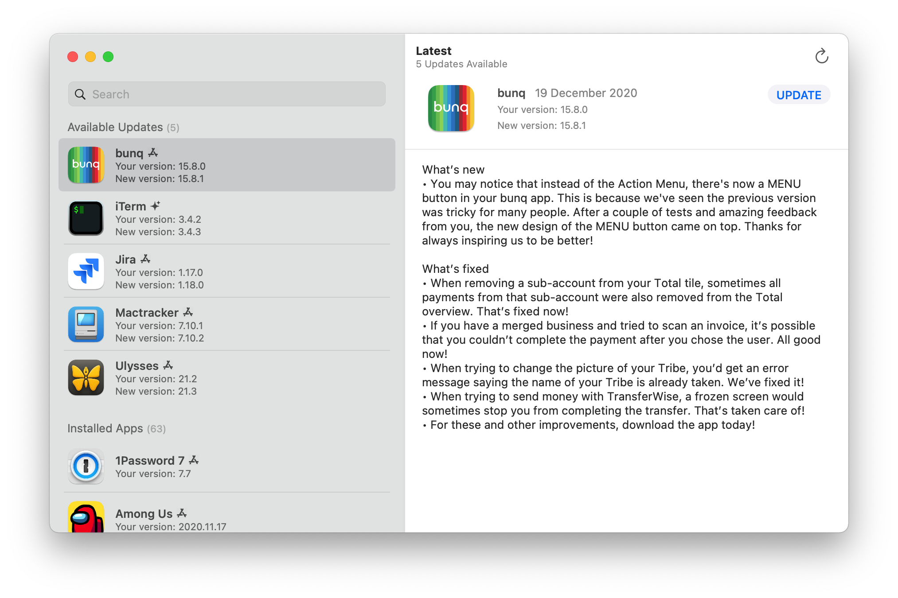
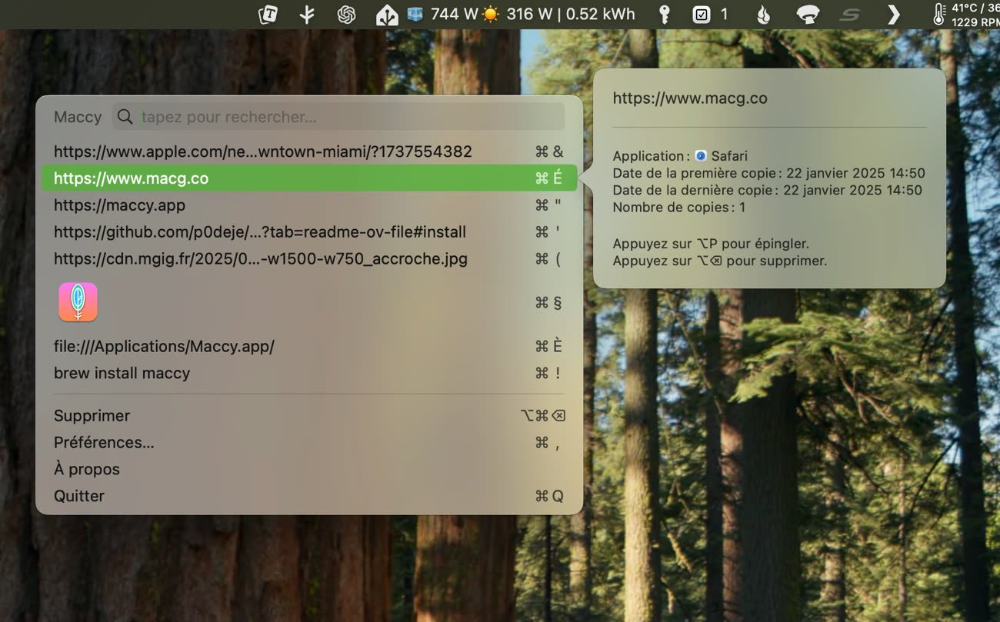

# Logiciels

## Internet

### Warp.dev

<figure><figcaption></figcaption></figure>

#### Description

Warp est un émulateur de terminal écrit en **Rust**.\
\
Il se distingue par des fonctionnalités telles que Warp Drive pour le partage de commandes entre équipes, Warp AI pour les suggestions et l'assistance des commandes, ainsi qu'un IDE moderne avec une sélection de texte et un positionnement du curseur.

#### Installation

```bash
# Installation via le fichier d'installation #
```


Source : [https://github.com/warpdotdev/Warp](https://github.com/warpdotdev/Warp)



Site Internet : [https://www.warp.dev](https://www.warp.dev/)


***

### Firefox

<figure><figcaption></figcaption></figure>

#### Description

Navigateur web de la fondation Mozilla orientée vie privée

#### Installation

```bash
# Installation via le fichier d'installation #
```


Source : [https://firefox-source-docs.mozilla.org/widget/cocoa/index.html](https://firefox-source-docs.mozilla.org/widget/cocoa/index.html)



Site Internet : [https://www.mozilla.org/fr/firefox/mac/](https://www.mozilla.org/fr/firefox/mac/)


***

### Firefox Developer Edition

<figure><figcaption></figcaption></figure>

#### Description

Variante du navigateur web de la fondation Mozilla orientée vie privée

#### Installation

<pre class="language-bash"><code class="lang-bash"><strong># Installation via le fichier d'installation #
</strong></code></pre>


Source : [https://firefox-source-docs.mozilla.org/devtools-user/](https://firefox-source-docs.mozilla.org/devtools-user/)



Site Internet : [https://www.mozilla.org/fr/firefox/developer/](https://www.mozilla.org/fr/firefox/developer/)


#### Extensions & Themes

Découvrez divers extensions & thèmes sur ce wiki en cliquant sur le lien


[firefox-extensions](../../logiciels/browsers/firefox-extensions/)


***

## Utilitaires

### WiFi Signal : Strength Analyzer

<figure><figcaption></figcaption></figure>

#### Description

WiFi Signal lets you monitor your Wi-Fi network’s status and signal quality, notifying you about changes in your Wi-Fi connection

#### Installation

```bash
# Installation via le Mac App Store #
```


Source : [https://apps.apple.com/fr/app/wifi-signal-status-monitor/id525912054](https://apps.apple.com/fr/app/wifi-signal-status-monitor/id525912054?mt=12)



Site Internet : [https://www.intuitibits.com/products/wifisignal/](https://www.intuitibits.com/products/wifisignal/)


***

## Onyx

<figure><figcaption></figcaption></figure>

#### Description

Une trousse à outils indispensable qui dispose d’une centaine de fonctionnalités, telles que, le nettoyage du Mac, la reconstruction de services défectueux, la vérification de la structure du système de fichiers, l’exécution des scripts de maintenance, la configuration des paramètres cachés du Finder, du Dock, de Safari et de plusieurs applications Apple…

#### Installation

```bash
# Installation via le fichier d'installation #
```


Site Internet : [https://www.titanium-software.fr/fr/onyx.html](https://www.titanium-software.fr/fr/onyx.html)


***

## Duet Display

<figure><figcaption></figcaption></figure>

#### Description

Duet transforme votre iPhone ou iPad dans l’écran supplementaire le plus avancé pour votre Mac & PC.

#### Installation

<pre class="language-bash"><code class="lang-bash"><strong># Installation via le Mac App Store #
</strong></code></pre>


Source : [https://apps.apple.com/fr/app/duet-display/id935754064](https://apps.apple.com/fr/app/duet-display/id935754064)



Site Internet : [https://www.duetdisplay.com/fr](https://www.duetdisplay.com/fr)


***

## Magnet

<figure><figcaption></figcaption></figure>

#### Description

Permets de redimensionner les fenêtres de manière appropriée.

#### Installation

```bash
# Installation via le Mac App Store #
```


Source : [https://apps.apple.com/fr/app/magnet/id441258766](https://apps.apple.com/fr/app/magnet/id441258766)



Site Internet : [https://magnet.crowdcafe.com](https://magnet.crowdcafe.com/index.html)


***

## CleanMyMac X

<figure><figcaption></figcaption></figure>

#### Description

Supprimez des tonnes de fichiers inutiles ou malveillants, et accélérez et organisez votre Mac.

CleanMyMac X regroupe plus de 30 outils conçus pour vous aider à résoudre les problèmes courants sur Mac. Il vous permet de gérer votre espace de stockage et vos applications, et de surveiller la santé de votre ordinateur.

#### Installation

```bash
# Installation via le Mac App Store #
```


Source : [https://apps.apple.com/fr/app/cleanmymac-x/id1339170533](https://apps.apple.com/fr/app/cleanmymac-x/id1339170533)



Site Internet : [https://macpaw.com/fr/cleanmymac](https://macpaw.com/fr/cleanmymac)


***

## WiFi Explorer : Scanner

<figure><figcaption></figcaption></figure>

#### Description

Découvrez, surveillez et dépannez les réseaux sans fil.

Identifiez rapidement les conflits de canaux, les chevauchements de signaux ou les problèmes de configuration susceptibles d'affecter la connectivité et les performances de votre réseau sans fil

#### Installation

```bash
# Installation via le Mac App Store #
```


Source : [https://apps.apple.com/us/app/wifi-explorer-scanner/id494803304](https://apps.apple.com/us/app/wifi-explorer-scanner/id494803304)



Site Internet : [https://www.intuitibits.com/products/wifiexplorer/](https://www.intuitibits.com/products/wifiexplorer/)


***

## TopNotch

<figure><figcaption></figcaption></figure>

#### Description

Masquer le Notch du MacBook Pro 14 / 16″ et MacBook Air (M2)

#### Installation

```bash
# Installation via le fichier d'installation #
```


Site Internet : [https://topnotch.app/](https://topnotch.app/)


***

## Latest

<figure><figcaption></figcaption></figure>

#### Description

Pour maintenir automatiquement ses apps à jour sur Mac, Vous pouvez confier la tâche à un utilitaire open-source pour macOS

#### Installation

```bash
# Installation via le fichier d'installation #
```


Source : [https://github.com/mangerlahn/Latest](https://github.com/mangerlahn/Latest)



Site Internet : [https://max.codes/latest](https://max.codes/latest/)


***

## Scratchpad

<figure><figcaption></figcaption></figure>

#### Description

Prise de notes instantanée depuis la barre de tâches

#### Installation

```bash
# Installation via le Mac App Store #
```


Source : [https://apps.apple.com/app/id6504040051](https://apps.apple.com/app/id6504040051)



Site Internet : [https://sindresorhus.com/scratchpad](https://sindresorhus.com/scratchpad)


***

## Menu Bar Spacing

<figure><figcaption></figcaption></figure>

#### Description

Personnaliser l'espace des icônes présent dans votre barre de menu.

Très pratique si vous avez beaucoup d'extensions ou un MacBook avec un notch

#### Installation

```bash
# Installation via le fichier d'installation #
```


Source : [https://github.com/sindresorhus/menu-bar-spacing-meta/releases](https://github.com/sindresorhus/menu-bar-spacing-meta/releases)



Site Internet : [https://sindresorhus.com/menu-bar-spacing](https://sindresorhus.com/menu-bar-spacing)


***

## Velja

<figure><figcaption></figcaption></figure>

#### Description

Vous permets de choisir dans quel navigateur sera ouvert vos liens, et de changer ensuite

#### Installation

```bash
# Installation via le Mac App Store #
```


Source : [https://apps.apple.com/app/id1607635845](https://apps.apple.com/app/id1607635845)



Site Internet : [https://sindresorhus.com/velja](https://sindresorhus.com/velja)


***

## Homebrew

<figure><figcaption></figcaption></figure>

#### Description

Un gestionnaire de paquets pour macOS gratuit et open-source écrit en Ruby.&#x20;

#### Installation

#### Installation en ligne de commande

Copiez et collez dans une fenêtre du Terminal.

```bash
/bin/bash -c "$(curl -fsSL https://raw.githubusercontent.com/Homebrew/install/HEAD/install.sh)"
```

#### Installation via package

Sur MacOS, il est possible de passer par installateur `.pkg`. Téléchargez-le depuis la page "GitHub releases"

```bash
https://github.com/Homebrew/brew/releases
```


Source : [https://github.com/Homebrew/brew](https://github.com/Homebrew/brew)



Site Internet : [https://brew.sh/fr/](https://brew.sh/fr/)


***

## MacPorts

#### Description

Un autre gestionnaire de paquets pour macOS

**Notes** : MacPorts utilise des archives de code source, ce qui peut entraîner un léger retard pour obtenir les versions les plus récentes

#### Installation via le package .pkg (recommandée)

1. Téléchargez le dernier installateur `.pkg` pour votre version de macOS depuis le site officiel de MacPorts.
2. Double-cliquez sur le fichier `.pkg` téléchargé pour lancer l'installation.
3. Suivez les instructions à l'écran pour terminer l'installation.
4. Une fois l'installation terminée, ouvrez un nouveau terminal et vérifiez que MacPorts est bien installé en tapant :

```bash
port version
```


Source : [https://github.com/macports/macports-base/releases/](https://github.com/macports/macports-base/releases/)



Site Internet : [https://www.macports.org](https://www.macports.org/install.php)


***

## MicMac

#### Description

Un outil gratuit permettant la configuration rapide, le nettoyage et la maintenance quotidienne du système macOS. Il est développé par [**Denis Dubois**](https://x.com/dedubo), rédacteur pour le magazine [VVMac Hebdo](https://www.vvmac.com/), l'utilitaire s’inspire de l’application populaire [Onyx](https://www.justgeek.fr/onyx-un-utilitaire-de-nettoyage-complet-pour-votre-mac-83684/). \
\
La différence ? MicMac intègre des fonctionnalités supplémentaires qui le rendent encore plus efficace pour personnaliser et maintenir votre ordinateur en parfaite santé

#### Installation

```bash
# Installation via le fichier d'installation #
```


Site Internet : [https://www.micmac-app.fr/fr](https://www.micmac-app.fr/fr/index.html)


***

## Kaomoji Drawer

<figure><figcaption></figcaption></figure>

#### Description

Une application qui permets l'accès aux émoticônes japonaises (kaomojis) directement depuis la barre de menu Mac

#### Installation

```
# Installation via le Mac App Store #
```


Source : [https://apps.apple.com/us/app/kaomoji-drawer/id6670708214](https://apps.apple.com/us/app/kaomoji-drawer/id6670708214?mt=12)



Site : [https://dakotafelder.com/kaomoji-drawer](https://dakotafelder.com/kaomoji-drawer/)


***

## Maccy

<figure><figcaption></figcaption></figure>

#### Description

Maccy est un gestionnaire de presse-papiers destiné écrit en **Swift**.

#### Installation

```bash
# Installation via le fichier d'installation #
```


Source : [https://github.com/p0deje/Maccy/tree/master](https://github.com/p0deje/Maccy/tree/master)



Site Internet : [https://maccy.app](https://maccy.app/)


***

## **MARTA File Manager**

<figure><figcaption></figcaption></figure>

#### Description

**MARTA File Manager** est une application de gestion de fichiers écrite entièrement en Swift, elle se distingue par sa performance exceptionnelle et son respect de la vie privée.

#### Installation

```bash
# Installation via le fichier d'installation #
```


Source : [https://github.com/marta-file-manager](https://github.com/marta-file-manager)



Site Internet : [https://marta.sh](https://marta.sh/download/)


***

## Nping


<figure><figcaption></figcaption></figure>

#### Description

**Nping,** un outil de ping développé en Rust. Il prend en charge le ping simultané pour plusieurs adresses, l'affichage de graphiques visuels, les mises à jour de données en temps réel et d'autres fonctionnalités.

#### Installation via HomeBrew

```bash
brew tap hanshuaikang/nping
brew install nping

nping --help
```


Source : [https://github.com/hanshuaikang/Nping](https://github.com/hanshuaikang/Nping)


#### Usage

```
nping www.google.com www.apple.com www.microsoft.com -c 20 -i 2

nping --help

🏎 Nping mean NB Ping, A Ping Tool in Rust with Real-Time Data and Visualizations

Usage: nping [OPTIONS] <TARGET>...

Arguments:
  <TARGET>...  target IP address or hostname to ping

Options:
  -c, --count <COUNT>        Number of pings to send [default: 65535]
  -i, --interval <INTERVAL>  Interval in seconds between pings [default: 0]
  -6, --force_ipv6           Force using IPv6
  -m, --multiple <MULTIPLE>  Specify the maximum number of target addresses, Only works on one target address [default: 0]
  -v, --view-type <VIEW_TYPE>  view mode graph or table [default: graph]
  -h, --help                 Print help
  -V, --version              Print version
```
